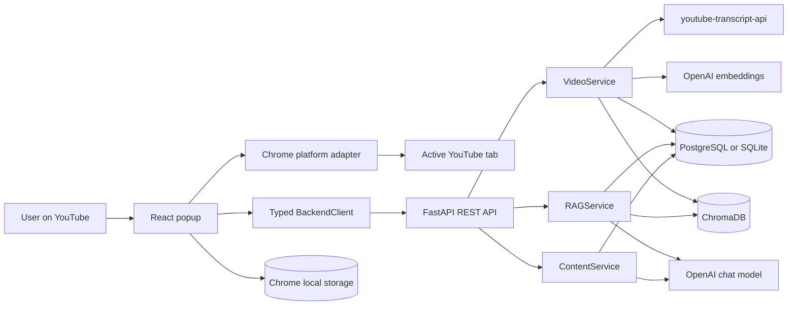
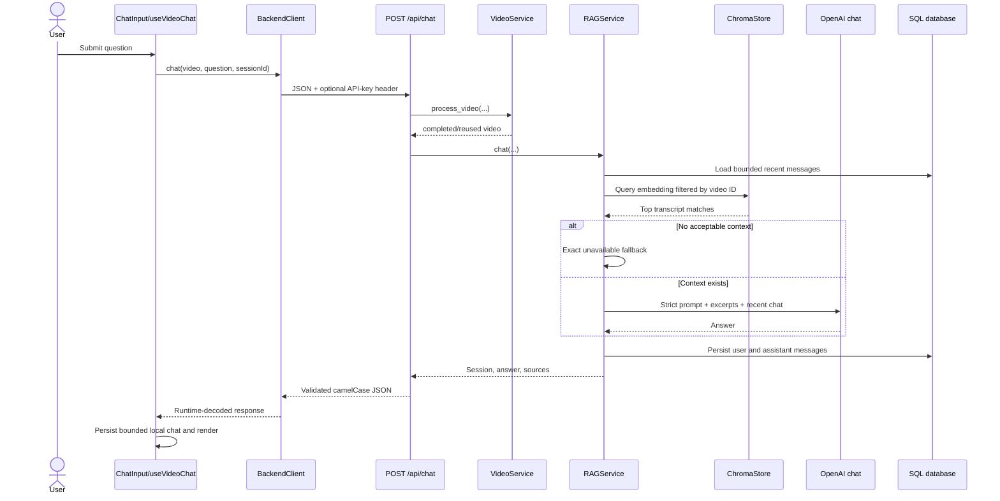
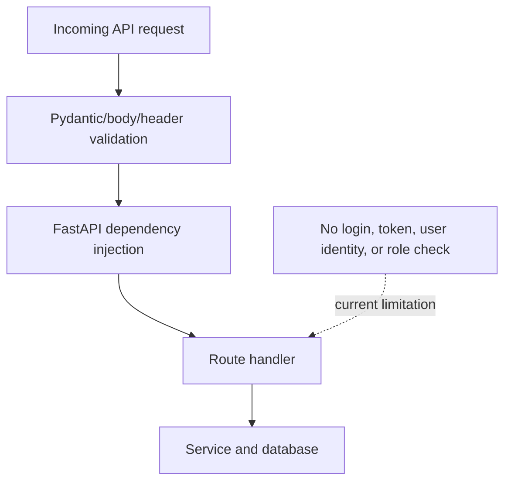
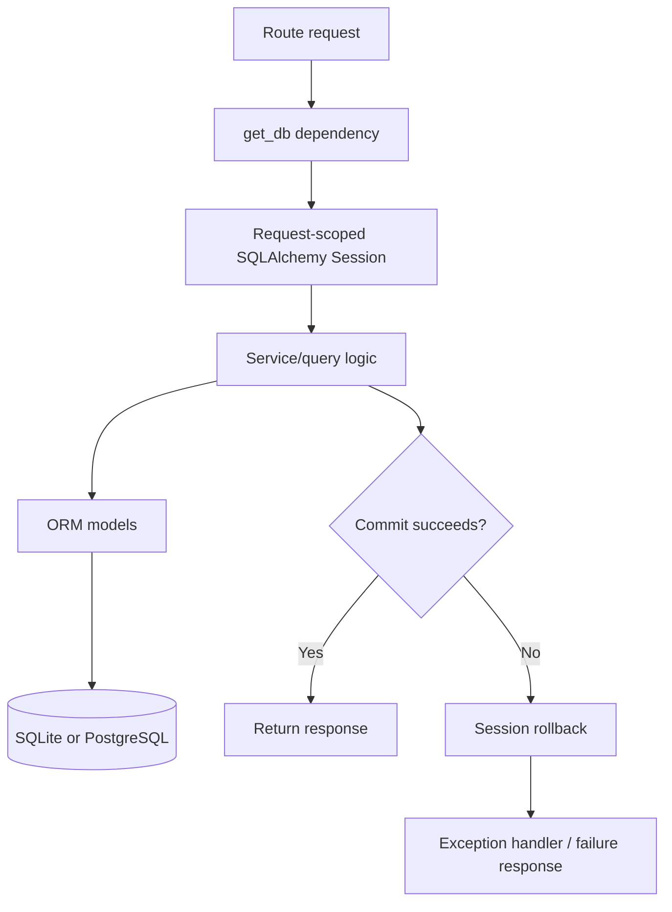
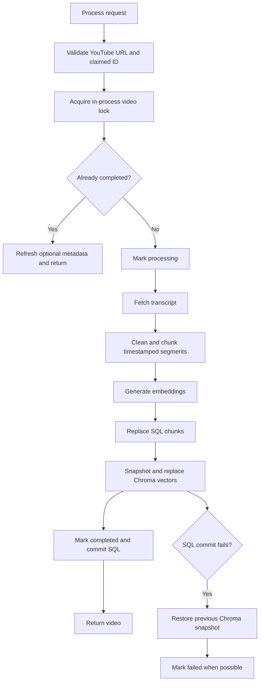
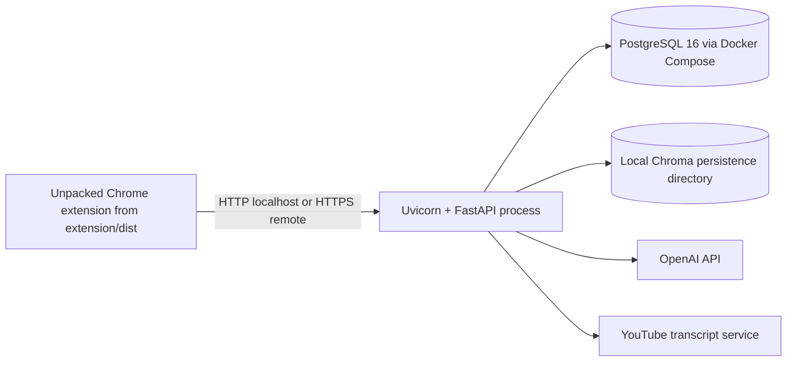
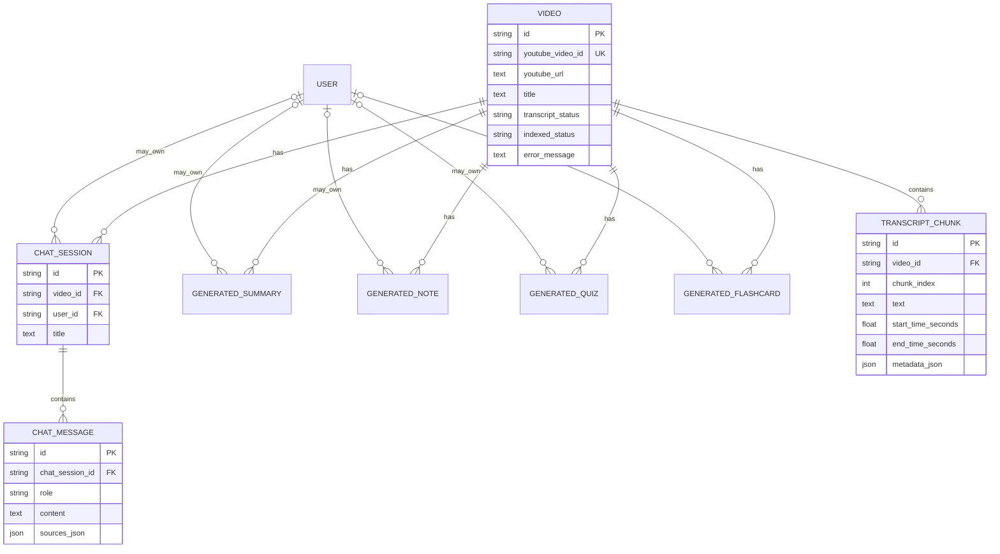
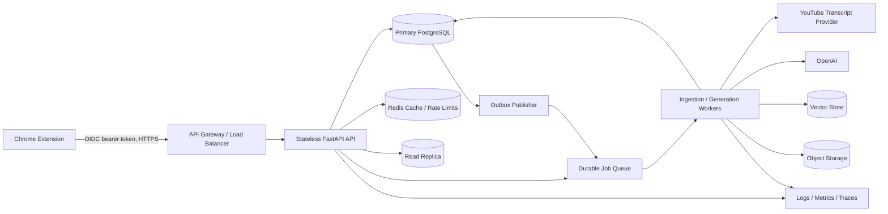

# TubeMind AI — Project Interview Preparation

> Repository-grounded preparation guide for technical interviews and placement discussions.
>
> Evidence snapshot: current working tree reviewed on 27 July 2026. The application is a local-first Chrome extension plus FastAPI backend. Statements labeled **Current** are visible in the code. Statements labeled **Partial** have some implementation but important limitations. Statements labeled **Proposed** are interview design improvements, not claims about the repository.

## Truthfulness legend

| Label | Meaning |
|---|---|
| **Current** | Implemented in the repository and traceable to named files/functions. |
| **Partial** | Implemented for the local MVP, but missing production or full workflow behavior. |
| **Proposed** | A reasonable future design; not implemented. |
| **Not present** | The repository contains no such mechanism. |

## Current implementation at a glance

- **Current:** React/TypeScript Manifest V3 popup, YouTube URL detection, transcript processing, timestamp-aware chunking, OpenAI embeddings/chat generation, per-video Chroma retrieval, SQLAlchemy persistence, summaries, notes, quizzes, flashcards, saved history, local state restoration, validation, tests, Alembic, Docker Compose for PostgreSQL, and GitHub Actions CI.
- **Partial:** conversational history is bounded and included in follow-up retrieval, but there is no query-rewriting model; long AI operations remain request/response operations; storage is bounded per video but has no global eviction policy; deployment documentation exists but there is no backend container image.
- **Not present:** login, signup, JWT, OAuth/SSO, RBAC, admin panel, analytics, billing, rate limiting, Redis, a queue, background workers, a scheduler, centralized logging, metrics, tracing, alerting, a CDN, or a production hosting manifest.
- **Verified locally:** 61 backend tests passed; TypeScript/Vite production build passed; Manifest V3 packaging verification passed; Alembic upgrade and drift checks passed.
- **Not externally verified:** a real OpenAI request, a live YouTube transcript-to-answer workflow, and a PostgreSQL Docker run require credentials/network/runtime access beyond the offline automated suite.

---

# 1. Project Introduction

## Project name

**TubeMind AI**

## One-line description

TubeMind AI is a Chrome extension and FastAPI RAG backend that lets a user ask transcript-grounded questions about the currently open YouTube video and generate summaries, notes, quizzes, and flashcards with timestamp sources.

## Problem it solves

Long videos are difficult to search and revise. A learner often wants a specific explanation, a concise summary, or study material without manually scrubbing through an entire video. TubeMind turns an available YouTube transcript into a searchable, timestamp-aware knowledge source and gives the user a compact interface inside Chrome.

## Target users

- Students revising lectures and tutorials.
- Software engineers learning from technical videos.
- Interview candidates extracting notes, questions, and flashcards.
- Any user who wants to locate transcript-supported information quickly.

## Main use cases

1. Ask a factual question about the current video.
2. Continue with a bounded follow-up conversation.
3. Jump from an answer source to the relevant YouTube timestamp.
4. Generate one of four summary formats.
5. Generate structured study notes.
6. Generate MCQs and flashcards.
7. Reopen local chat/study state or inspect backend history.
8. Configure a local or HTTPS backend and an optional client-provided OpenAI key.

## Why it is useful

The project reduces the cost of navigating long-form video. Its answers are constrained to retrieved transcript excerpts, and source chips make the output inspectable rather than presenting an unsupported answer without evidence.

## What makes it technically interesting

- It joins a browser extension, a typed frontend, an HTTP API, relational persistence, a vector database, and external AI services.
- It preserves timestamps through transcript chunking and retrieval.
- It partitions vector search by `youtubeVideoId`, preventing cross-video retrieval.
- It handles dual persistence: Chrome local storage for immediate per-video UI state and SQL tables for durable history.
- It includes partial-failure compensation between SQL and Chroma during re-indexing.
- It validates both backend schemas and frontend runtime responses.
- It treats the “not available” response as an explicit grounding contract.

## A truthful description of my contribution

Authorship cannot be proven from source code alone. If you built this repository, a defensible statement is:

> I designed and implemented the Chrome extension and FastAPI backend, including YouTube detection, transcript ingestion, chunking, OpenAI integration, Chroma retrieval, SQLAlchemy models, generated study content, timestamp navigation, history restoration, validation, tests, migrations, and CI. I also documented the local-versus-production boundaries instead of claiming that authentication or large-scale deployment already exists.

Do not claim that you built a deployed one-million-user platform, production authentication, payment handling, or measured latency improvements; those claims are not supported by the repository.

## 30-second introduction

> TubeMind AI is a Chrome extension that lets users chat with the YouTube video they are watching. The extension detects the video, and a FastAPI backend fetches and chunks its transcript, creates OpenAI embeddings, and stores them in ChromaDB. Questions are answered through per-video retrieval, and the response includes clickable timestamps. I also implemented summaries, notes, quizzes, flashcards, SQL-backed history, local state restoration, validation, migrations, and automated tests.

## 60-second introduction

> I built TubeMind AI to make long YouTube lectures easier to search and revise. It has a React and TypeScript Manifest V3 extension and a Python FastAPI backend. When the popup opens, it detects the active YouTube video and asks the backend to process it. The backend validates the URL and video ID, fetches the transcript, creates timestamp-aware overlapping chunks, stores chunk records in SQL, generates OpenAI embeddings, and replaces that video’s vectors in ChromaDB. For chat, the system embeds a bounded contextual query, retrieves only vectors filtered by the current `youtubeVideoId`, sends those excerpts to a strict prompt, persists the conversation, and returns timestamp sources. The same transcript corpus powers summaries, notes, MCQs, and flashcards. I added local per-video state, backend history, defensive response decoding, CORS and API-key protections, Alembic migration checks, and 61 offline tests. It is an honest local MVP; authentication, rate limiting, distributed jobs, and production monitoring are future work.

## Two-minute explanation

> TubeMind AI is a local-first full-stack RAG application built as a Chrome extension plus a FastAPI service. The user opens a YouTube watch page, Short, embed, live URL, or `youtu.be` link. The popup reads the active tab through a Chrome adapter, validates the video route, derives the thumbnail, and initializes several focused hooks for video processing, chat, generated content, and history.
>
> The process-video endpoint validates that the claimed ID matches the YouTube URL. `VideoService` uses an in-process per-video lock so concurrent requests in one backend process do not duplicate ingestion. It fetches the transcript, cleans and groups timestamped segments, stores relational chunk metadata, generates embeddings, and replaces only that video’s Chroma vectors. If the final SQL commit fails after vector replacement, it attempts to restore the previous Chroma snapshot.
>
> In chat, `RAGService` loads a bounded recent conversation for follow-up context, embeds the contextual query, and retrieves the top matches using a mandatory `youtubeVideoId` filter and configurable distance threshold. The prompt explicitly forbids external knowledge. Empty retrieval or a normalized unsupported model answer returns exactly `This information is not available in the video.` with no sources. Successful messages and their source metadata are stored in SQL.
>
> The frontend uses runtime decoders instead of blindly trusting JSON. It applies timeouts and cancellation, validates Chrome storage, recovers when a locally stored chat session no longer exists on the backend, and safely renders Markdown without loading remote images. The repository also contains Alembic, PostgreSQL Docker Compose, SQLite support, CI, schema and security tests, and a build verifier for extension assets. The important limitation is that it is not a multi-user production SaaS: there is no authentication, user isolation, rate limiting, distributed locking, queue, or monitoring stack.

---

# 2. Project Features

## Feature-status matrix

| Area | Status | Evidence |
|---|---|---|
| Detect active YouTube video | **Current** | `useCurrentTab.ts`, `useYoutubeVideo.ts`, `utils/youtube.ts` |
| Watch/Shorts/embed/live/short URL parsing | **Current** | frontend and backend YouTube utilities |
| Transcript ingestion and chunking | **Current** | `TranscriptService`, `ChunkingService` |
| SQL transcript metadata | **Current** | `Video`, `TranscriptChunk`, `VideoService` |
| OpenAI embeddings and LLM | **Current integration**; live call not verified | `EmbeddingService`, `LLMService` |
| Per-video Chroma retrieval | **Current** | `ChromaStore.query`, `VideoRetriever.retrieve` |
| Chat with timestamp sources | **Current** | `RAGService.chat`, `SourceTimestamp.tsx` |
| Bounded conversational follow-ups | **Current**, simple approach | recent eight messages in `RAGService.chat` |
| Four summary modes | **Current** | `SummaryRequest`, `SummaryModePicker`, `ContentService.summary` |
| Study notes | **Current** | `ContentService.notes`, `NotesPage` |
| MCQ quiz | **Current** | strict schemas, `QuizPage` |
| Flashcards | **Current** | strict schemas, `FlashcardsPage` |
| Chrome local persistence | **Current** | `useVideoChat`, `useGeneratedContent` |
| SQL history | **Current** | `/api/history`, generated-content tables |
| History detail and chat restore | **Current** | `HistoryDetailPage`, `/api/history/chat/{session_id}` |
| Custom backend permissions | **Current** | `platform/chrome.ts`, optional host permissions |
| Server or client API key | **Current** | settings, `X-OpenAI-API-Key`, backend fallback |
| Authentication/RBAC | **Not present** | no login routes, token code, or ownership dependency |
| Admin features | **Not present** | no admin UI/API |
| Analytics/reporting | **Not present** | no event or reporting subsystem |
| Export notes/PDF | **Planned only in product document** | no export implementation |
| Whisper fallback | **Planned only** | no audio transcription path |
| Playlist/multi-video chat | **Planned only** | current filter is one video ID |

## Important feature walkthroughs

### 2.1 Current-video detection

- **What:** obtains the active Chrome tab, extracts a supported YouTube video ID, title, URL, and thumbnail.
- **Why:** all downstream indexing and retrieval must be scoped to the exact current video.
- **How:** `queryActiveTab()` in `extension/src/popup/platform/chrome.ts` wraps `chrome.tabs.query`; `useYoutubeVideo()` calls `extractYoutubeVideoId()`.
- **Edge cases:** invalid URL, unsupported host, non-video YouTube page, invalid video ID, missing tab access.
- **Interview questions:** Why validate the host exactly? Why not use `hostname.includes("youtube.com")`? What is the purpose of `activeTab` versus `tabs`?

### 2.2 Video ingestion

- **What:** turns a transcript into SQL chunks and Chroma vectors.
- **Why:** chat needs semantic retrieval and timestamp metadata.
- **How:** `POST /api/videos/process` → `VideoService.process_video()` → `TranscriptService.fetch()` → `ChunkingService.chunk()` → `EmbeddingService.embed_documents()` → `ChromaStore.replace_video()` → SQL commit.
- **Edge cases:** URL/ID mismatch, missing transcript, empty chunks, embedding failure, vector failure, final SQL commit failure, duplicate process requests.
- **Important reliability behavior:** completed videos are reused; metadata can be refreshed; one-process concurrent requests share a lock; Chroma replacement retains a rollback snapshot.
- **Interview questions:** How is idempotency implemented? What race remains with multiple workers? How do you handle a partial SQL/vector failure?

### 2.3 Transcript-grounded chat

- **What:** answers a question from relevant transcript excerpts.
- **How:** `POST /api/chat` first ensures processing, then `RAGService.chat()` loads recent messages, creates a contextual retrieval query, calls `VideoRetriever`, builds a strict prompt, persists messages, and returns `Source` objects.
- **Edge cases:** stale session ID, session from another video, no retrieved matches, model fallback wording, database rollback on request failure.
- **Interview questions:** Why is vector filtering mandatory? Why can prompting alone not guarantee zero hallucination? How would you add cited chunk IDs?

### 2.4 Timestamp navigation

- **What:** jumps the active tab to the source time.
- **How:** the backend creates labels and URLs, but the frontend deliberately builds a canonical URL from the active `videoId` and source seconds in `navigateToYoutubeTimestamp()`.
- **Security value:** the extension does not trust an arbitrary backend source URL for navigation.
- **Interview questions:** Why recompute the URL? How do you validate seconds and video IDs?

### 2.5 Generated study content

- **What:** summary, notes, quiz, and flashcards based on the transcript corpus.
- **How:** `TranscriptCorpusService` removes overlap and packs bounded sections; `ContentService` optionally reduces long transcripts, calls the relevant prompt, validates structured JSON for quiz/cards, and persists the result.
- **Edge cases:** no processed video, no corpus, empty LLM result, malformed JSON, wrong item count, non-shrinking oversized reduction.
- **Interview questions:** Why validate model output? Why is long-context generation different from top-K RAG?

### 2.6 Dual history and restoration

- **What:** Chrome storage preserves immediate per-video UI state; SQL preserves backend history.
- **How:** local keys include `chat:{videoId}` and `generated:{videoId}`. `/api/history` merges video, chat, and generated-content records. Chat details come from `/api/history/chat/{session_id}` and can be written back into local storage before navigating to the video.
- **Edge cases:** corrupt local storage, backend reset with stale local session, empty history, missing chat ID, navigation failure.
- **Interview questions:** Why use two persistence layers? How do you keep them consistent? Why is local storage not a secure server-side identity mechanism?

### 2.7 Settings and API-key handling

- **What:** configures backend origin and optional OpenAI key.
- **How:** `SettingsPage` saves through `saveSettingsWithPermission()`, which requires HTTPS outside loopback and requests the exact Chrome origin permission. `BackendClient` sends the key in `X-OpenAI-API-Key`; backend routes choose the client key or configured server key.
- **Security:** keys are not persisted by the backend and are excluded from serialized Pydantic models; validation errors are sanitized.
- **Limitation:** Chrome local storage is device-local, not encrypted application storage; there is no user account.
- **Interview questions:** Why prefer a header over request-body keys? How would production key management differ?

## Admin, analytics, and reporting

- **Admin features:** none.
- **Analytics/reporting:** none.
- **Audit logging:** none.
- **Safe interview answer:** “The current scope is a local single-user learning tool. I would not describe the history page as an admin dashboard or analytics system.”

---

# 3. Technology Stack

| Technology | Actual use | Why it fits | Benefits | Limitations | Alternatives and when better |
|---|---|---|---|---|---|
| TypeScript | Extension UI and Chrome adapters | Cross-layer contracts need static checking | Safer refactoring, strict UI types | Runtime JSON still needs validation | JavaScript for a smaller prototype; Rust/WASM only for CPU-heavy browser work |
| React 18 | Popup components/pages | Stateful, reusable popup UI | Component composition and hooks | Popup lifecycle is short; bundle overhead | Preact/Solid for smaller bundles; vanilla TS for a tiny UI |
| Vite 6 | Multi-entry extension build | Fast TS/React build with Rollup output control | Handles popup, worker, content script | Extension packaging needs custom verification | Plasmo/WXT for more extension conventions; Webpack for legacy ecosystems |
| Tailwind CSS | Popup styling | Compact component styling | Consistent spacing and rapid UI work | Long class strings; design-system discipline still needed | CSS Modules for local styles; component library for larger teams |
| Chrome Manifest V3 | Browser extension runtime | Required modern Chrome model | Scoped permissions, service worker | Worker lifecycle and permission restrictions | Web app if browser integration is unnecessary |
| Chrome local storage | Settings and bounded per-video state | Survives popup close without backend identity | Simple and extension-native | Quota, no global eviction, API key not app-encrypted | IndexedDB for larger local data; server store for multi-device state |
| Python 3.11+ | Backend | AI/data ecosystem | Strong libraries and readable services | CPU-bound work needs process strategies | Go/Java for high-throughput services; Python remains good for AI orchestration |
| FastAPI | REST routes, DI, validation handlers, CORS | Typed async API around Pydantic | OpenAPI, dependencies, concise routes | Sync SQL calls can block async workers | Django for batteries/auth/admin; Flask for minimal service; gRPC for internal typed RPC |
| Pydantic v2 | Settings and API schemas | Contract validation and camelCase aliases | Strong validation/serialization | Must still sanitize secret-related errors | Marshmallow or dataclasses for other ecosystems |
| SQLAlchemy 2 | ORM and sessions | Portable SQLite/PostgreSQL model | Relationships, transactions, expressive queries | No repository abstraction; sync sessions in async endpoints | SQLModel for simpler models; raw SQL for tuned hot paths |
| Alembic | Schema migration | SQLAlchemy-native migration path | Versioned upgrades and drift checks | One initial migration; production operations still needed | Flyway/Liquibase in polyglot organizations |
| PostgreSQL 16 | Documented production relational DB | Strong transactions and indexing | Durable relational model, JSON support | Requires operations and pooling | SQLite for local use; managed Postgres for production |
| SQLite | Local/test zero-setup DB | Easy development and deterministic tests | No server required | Different concurrency/type behavior from Postgres | PostgreSQL test containers for higher fidelity |
| ChromaDB | Local persistent vector store | Simple MVP vector search | Metadata filters and local persistence | Process/local operational model, index-version concerns | Qdrant/Weaviate/Pinecone for distributed production |
| LangChain OpenAI | Chat and embedding adapters | Integrates OpenAI models with async methods | Common abstraction and model configuration | Adds dependency surface; provider behavior remains external | Direct OpenAI SDK for less abstraction; provider-neutral gateway for multi-model routing |
| OpenAI models | Embeddings and generation | Actual configured provider | Strong general embeddings/generation | Cost, latency, rate limits, credentials, external failure | Local models for privacy; other providers behind an adapter |
| youtube-transcript-api | Transcript acquisition | Avoids downloading/transcribing video audio | Lightweight and timestamped | Transcript availability and upstream changes | Official APIs where applicable; Whisper fallback for audio |
| Pytest | Backend tests | Natural Python test ecosystem | Fixtures, parametrization, monkeypatching | No measured coverage; mostly mocked boundaries | Testcontainers for integration; Playwright for extension E2E |
| HTTPX2/TestClient | FastAPI API testing | In-process HTTP-style assertions | Exercises validation/middleware/routes | Not a real network or deployment test | Real server integration tests for transport behavior |
| Docker Compose | PostgreSQL development service | Repeatable local DB | Health check and persistent volume | Backend itself is not containerized | Full Compose/Kubernetes for deployment |
| GitHub Actions | CI | Automated backend and extension checks | Tests, migration drift, build | No deployment, security scan, or browser E2E | GitLab CI/Jenkins depending on organization |

### Explicitly absent technologies

- **Authentication:** none.
- **State library:** no Redux/Zustand; focused React hooks own state.
- **Cache:** no Redis or server response cache.
- **Queue/background worker:** none.
- **Cloud:** no AWS/Azure/GCP service is configured.
- **Monitoring:** no Prometheus, OpenTelemetry, Sentry, or structured log pipeline.

---

# 4. System Architecture

## High-level architecture

The repository is a modular monolith split into two deployable concerns: a Chrome extension and one FastAPI backend. PostgreSQL/SQLite stores application records; Chroma stores embeddings and documents; YouTube transcripts and OpenAI are external integrations.



## Frontend architecture

- `App.tsx` composes pages and domain hooks.
- `platform/chrome.ts` adapts Chrome APIs.
- `backendClient.ts` is the HTTP transport plus runtime decoder boundary.
- Hooks isolate tab detection, processing, chat, generation, history, and generic storage.
- Pages compose reusable components.
- Types and YouTube utilities centralize contracts and validation.

## Backend architecture

- Routes are thin orchestration layers.
- FastAPI dependencies provide a request-scoped SQL session and access to the app-scoped service container.
- Services hold ingestion, RAG, corpus, embedding, transcript, and generation behavior.
- `ChromaStore` isolates vector persistence.
- SQLAlchemy models represent application persistence.
- Pydantic schemas enforce public request/response contracts.
- Exception handlers map service and validation failures to consistent JSON.

## Chat request-response flow



## Authentication flow: accurately showing absence



There is no authentication or authorization middleware. `user_id` columns exist for future use but routes do not assign or filter by a user.

## Database interaction



## Video-ingestion workflow



## Documented local runtime topology (not an actual deployment)



The repository does not include a backend Dockerfile, reverse proxy, TLS configuration, cloud deployment, load balancer, or production secrets manager.

---

# 5. Folder Structure

```text
tubemindAI/
├── backend/
│   ├── app/
│   │   ├── api/             # FastAPI route modules and route dependencies
│   │   ├── prompts/         # Grounded chat/generation prompt templates
│   │   ├── services/        # Ingestion, RAG, AI, transcript, and content logic
│   │   ├── utils/           # YouTube, text, and timestamp helpers
│   │   ├── vector_store/    # Chroma adapter and per-video retriever
│   │   ├── config.py        # Environment-backed settings
│   │   ├── container.py     # Service graph construction
│   │   ├── database.py      # Engine, session factory, FastAPI DB dependency
│   │   ├── main.py          # App factory, lifespan, middleware, handlers, routers
│   │   ├── models.py        # SQLAlchemy tables and relationships
│   │   └── schemas.py       # Pydantic API contracts
│   ├── migrations/          # Alembic environment and initial schema
│   ├── tests/               # Original focused backend tests
│   ├── requirements.txt
│   └── alembic.ini
├── extension/
│   ├── public/              # Manifest and extension icons
│   ├── scripts/             # Production-package verifier
│   ├── src/
│   │   ├── background.ts    # Settings initialization service worker
│   │   ├── contentScript.ts # Self-contained YouTube message responder
│   │   └── popup/
│   │       ├── api/         # HTTP client and runtime response decoders
│   │       ├── components/  # Reusable visual components
│   │       ├── hooks/       # Domain and persistence state
│   │       ├── pages/       # Chat, history, notes, quiz, cards, settings
│   │       ├── platform/    # Typed Chrome API adapter
│   │       ├── types/       # Frontend contracts
│   │       └── utils/       # Formatting and YouTube URL helpers
│   ├── package.json
│   └── vite.config.ts
├── tests/                   # Expanded backend unit/API/security/reliability tests
├── .github/workflows/ci.yml # Backend and extension CI
├── docker-compose.yml       # PostgreSQL development service
├── DOC.MD                   # Original product/build specification
└── README.md                # Setup, architecture, security, and verification
```

### Why this organization works

- Browser-specific APIs stay behind an adapter rather than leaking into every component.
- React hooks own workflow state while components remain presentation-focused.
- FastAPI routes remain thin and services contain business logic.
- SQL and vector persistence are separated because they have different consistency models.
- Prompt templates are reviewable separately from orchestration.
- Tests live at both the original backend location and the root expanded suite; `pytest.ini` discovers both.

---

# 6. End-to-End Application Flow

## 6.1 Popup startup

`User clicks extension` → `main.tsx` mounts `App` → `useCurrentTab()` calls `queryActiveTab()` → `useYoutubeVideo()` parses the URL → `useChromeStorage()` decodes settings → `BackendClient` is created → `useVideoProcessing()` begins ingestion → `VideoCard` shows processing/ready/failed.

## 6.2 New-video processing

`useVideoProcessing` → `BackendClient.processVideo()` → `POST /api/videos/process` in `video_routes.py` → `get_db` and `get_services` dependencies → `VideoService.process_video()` → YouTube validation → transcript fetch → `ChunkingService` → OpenAI embeddings → SQL chunk flush → `ChromaStore.replace_video()` → SQL commit → response decoder → status becomes `ready`.

## 6.3 Asking a question

`ChatInput` trims and submits → `useVideoChat.send()` appends/persists the local user message → `BackendClient.chat()` → `chat_routes.py` ensures the video is processed → `RAGService.chat()` validates/creates session → recent SQL messages become context → `VideoRetriever.retrieve()` embeds the contextual query → Chroma query filters by `youtubeVideoId` → distance filtering → strict prompt or exact fallback → SQL messages commit → response decoder → assistant message and sources persist locally → `MessageBubble` renders Markdown → `SourceTimestamp` can update the active tab.

## 6.4 Generating content

`QuickActions` → optional `SummaryModePicker` → `useGeneratedContent.execute()` → typed client method → relevant FastAPI route → `ContentService.transcript()` loads ordered chunks through `TranscriptCorpusService` → overlap removal and optional reduction → LLM completion → output validation/persistence → hook stores bounded local result → notes/quiz/cards page or summary chat message renders.

## 6.5 Viewing and restoring history

`Header → History` → `useHistory` calls `/api/history?limit=100` → `HistoryPage` renders normalized records → View:

- generated item: `HistoryDetailPage` safely inspects and renders saved content;
- chat item: client calls `/api/history/chat/{id}`, decodes ordered messages, and displays them;
- restore chat: `restoreChatHistory()` writes bounded messages/session to `chat:{videoId}`, then Chrome navigates to that video.

## 6.6 Saving a custom backend

`SettingsPage.submit()` → `saveSettingsWithPermission()` → normalize URL → reject credentials/query/path/insecure remote HTTP → request exact Chrome host permission → `useChromeStorage.save()` → new settings produce a new `BackendClient` → processing retries through hook dependencies.

## Middleware and error flow

There is no controller class layer; FastAPI route functions serve that role. `CORSMiddleware` handles allowed origins. Pydantic validates input. `ServiceError` subclasses become `{detail: ...}` with their status codes. `RequestValidationError` is sanitized so secret values are not echoed. `BackendClient` converts HTTP or network failures into `ApiError`; hooks convert those to user-facing state.

---

# 7. Database Design

## Technology and strategy

- SQLAlchemy 2 ORM.
- PostgreSQL URL in examples; SQLite is supported for zero-setup local runs and tests.
- Alembic `0001_initial` creates all current tables.
- App-scoped engine/session factory.
- SQLite enables foreign keys and uses `StaticPool` for in-memory tests.
- Migrations are the production path; `CREATE_SCHEMA_ON_STARTUP` is limited to local/test environments.

## Schema summary

| Table | Purpose | Key relationships/constraints |
|---|---|---|
| `users` | Future identity placeholder | UUID string PK; unique nullable email |
| `videos` | One row per YouTube video | unique `youtube_video_id`; lookup index; status fields |
| `transcript_chunks` | Ordered timestamped transcript data | FK to video, unique `(video_id, chunk_index)`, cascade delete |
| `chat_sessions` | Conversation container for a video | FK to video; optional FK to user |
| `chat_messages` | User/assistant messages and sources JSON | FK to session, cascade delete, created-time ordering |
| `generated_summaries` | Saved summaries | FK to video/user; type and content |
| `generated_notes` | Saved Markdown notes | FK to video/user; title/content/format |
| `generated_quizzes` | Saved validated quiz JSON | FK to video/user |
| `generated_flashcards` | Saved validated card JSON | FK to video/user |

## Entity relationship diagram



## Transactions and consistency

- `get_db()` rolls back when an exception escapes a request.
- Ingestion first records processing state, then fetches/embeds, flushes replacement SQL chunks, replaces Chroma vectors, and commits completion.
- `VectorSnapshot` enables best-effort Chroma compensation if the final SQL commit fails.
- This is not a distributed transaction; a compensation failure can still leave inconsistency.
- Completed-video checks prevent normal sequential re-indexing.

## Important queries

- `select(Video).where(Video.youtube_video_id == ...)`
- ordered transcript chunk retrieval by `chunk_index`
- chat session lookup constrained by both session ID and video ID
- recent chat messages ordered descending and limited to eight
- combined history queries, each joined to `Video`, then globally sorted and limited

## Performance concerns

- The history endpoint performs separate queries for videos, four generated-content types, and chat sessions. It is bounded but not a single union query.
- JSON source/content fields are convenient but not strongly queryable.
- No user ownership filtering exists.
- No connection-pool tuning is exposed.
- Sync SQLAlchemy sessions run inside async request handlers.
- Native PostgreSQL UUID/JSONB types are not used.

## Database interview questions

1. **Why use SQL for application data?** Relationships, unique constraints, ordered sessions, and transactions fit a relational model.
2. **Why use Chroma as well?** SQL stores authoritative metadata; Chroma performs vector similarity search.
3. **How is duplicate chunk order prevented?** Unique constraint on `(video_id, chunk_index)`.
4. **What does cascade delete achieve?** Removing a video/session removes dependent chunks/messages.
5. **Where can inconsistency occur?** Between SQL and Chroma because there is no distributed transaction.
6. **How would you scale history queries?** Add ownership and type/date indexes, cursor pagination, and possibly a unified activity table/materialized view.
7. **Would you shard now?** No. First measure, index, pool, archive, and use replicas; shard only after a real partitioning need.

---

# 8. API Documentation

All routes are mounted under `/api`. **Authentication and authorization requirements are none in the current code.**

| Method | Endpoint | Purpose | Request/query | Response | Main errors | Source |
|---|---|---|---|---|---|---|
| GET | `/api/health` | Liveness response | none | status/app | normally 200 | `health_routes.py` |
| POST | `/api/videos/process` | Ingest/index video | URL, ID, optional metadata; optional key header | video/status | 400 invalid video, 422 transcript, 503 config/provider | `video_routes.py` |
| POST | `/api/chat` | Grounded chat | video ref, question, optional session/key | session, answer, sources | 404 stale/wrong session, provider/process errors | `chat_routes.py` |
| POST | `/api/videos/summary` | Generate summary | ID, summary type, optional key | summary text | 404 unprocessed, 503 AI | `video_routes.py` |
| POST | `/api/notes/generate` | Generate notes | ID, `study_notes`, optional key | title/content | 404/503 | `notes_routes.py` |
| POST | `/api/quiz/generate` | Generate MCQ quiz | ID, 1–20 count, difficulty | validated questions | 404, 422 validation, 503 malformed AI/provider | `quiz_routes.py` |
| POST | `/api/flashcards/generate` | Generate cards | ID, 1–30 count | validated cards | 404/422/503 | `flashcard_routes.py` |
| GET | `/api/history` | Combined activity history | `limit` 1–200, default 50 | history items | DB failures | `history_routes.py` |
| GET | `/api/history/chat/{session_id}` | Ordered chat detail | path session ID | video/session/messages | 404 unknown session | `history_routes.py` |
| GET | `/api/videos/history` | Processed-video list | `limit` 1–200 | videos | DB failures | `video_routes.py` |
| GET | `/api/settings/providers` | Provider capabilities | none | OpenAI enabled/client storage | normally 200 | `settings_routes.py` |

## Detailed API 1: `POST /api/videos/process`

1. Pydantic validates URL, video-ID format, title length, and thumbnail URL.
2. Route obtains SQL session and service container.
3. `VideoService` verifies the actual URL ID equals the claimed ID.
4. An in-process lock serializes this video.
5. Completed rows return without transcript/embedding work.
6. Otherwise status becomes processing and is committed.
7. Transcript segments are fetched and chunked.
8. OpenAI document embeddings are generated.
9. Existing SQL chunks are deleted/replaced in the transaction.
10. Chroma vectors are snapshotted/replaced with mandatory metadata.
11. Completion state commits; on failure the service rolls back and compensates Chroma where possible.

## Detailed API 2: `POST /api/chat`

1. Validates URL, ID, non-blank question, lengths, and optional key.
2. Calls process-video, which is idempotent for a completed video.
3. Resolves the client or server API key.
4. `RAGService` validates the session belongs to this video or creates one.
5. Loads up to eight recent messages and builds a contextual retrieval query.
6. Embeds the query and asks Chroma for top-K results filtered by the current video.
7. Rejects results beyond `RETRIEVAL_MAX_DISTANCE`.
8. Empty context returns the exact unavailable response without calling the LLM.
9. Otherwise the prompt contains transcript excerpts, recent conversation, and current question.
10. Normalizes an unsupported answer to the exact fallback and removes sources.
11. Persists both messages and returns typed sources.

## Detailed API 3: `POST /api/quiz/generate`

1. Validates video ID, count, difficulty, and key length.
2. Loads a completed video and ordered transcript corpus.
3. Removes chunk overlap; reduces multiple oversized sections when needed.
4. Sends a JSON-only transcript-grounded quiz prompt.
5. Extracts a JSON object from plain or fenced model output.
6. Pydantic enforces exactly four distinct non-blank options, an exact matching answer, bounded text, and requested question count.
7. Invalid model structure becomes a controlled 503-style external-service error.
8. Valid quiz JSON is persisted and returned using camelCase fields.

---

# 9. Authentication and Security

## Authentication/authorization truth

- Login: **not present**.
- Signup: **not present**.
- SSO/OAuth: **not present**.
- JWT/session cookie: **not present**.
- Refresh token/expiration: **not present**.
- Password hashing: **not applicable; no passwords**.
- RBAC/protected routes: **not present**.
- User table: exists only as a future schema placeholder.
- Consequence: history and generated data are global to the backend database.

## Implemented security controls

- Exact YouTube host parsing and URL/claimed-ID equality.
- Pydantic bounds, enums, URL types, and non-blank validators.
- SQLAlchemy parameterization rather than string-built SQL.
- Mandatory per-video Chroma metadata filter.
- Exact fallback with no sources for rejected/unsupported retrieval.
- API keys excluded from model dumps/repr and sanitized from validation responses.
- Client key sent only to configured backend origin.
- Remote custom backend must use HTTPS.
- Runtime permission request is for the exact origin.
- Explicit CORS origins; a Chrome-extension wildcard requires opt-in.
- Safe Markdown links allow only HTTP(S); remote Markdown images are not loaded.
- Timestamp navigation is reconstructed from validated video ID/seconds.
- No file-upload surface.

## Security gaps

- No identity, ownership, tenant isolation, or endpoint authorization.
- No rate limit, usage quota, bot protection, or abuse control.
- No CSRF mechanism; the API uses no cookie auth, so conventional cookie-CSRF is not the current threat, but a future cookie design would require it.
- No Content Security Policy is explicitly declared in the manifest; MV3 applies defaults, but production should declare and review one.
- Client API key is stored in Chrome local storage, not application-level encrypted storage.
- No server-side encryption/key vault integration.
- No audit trail, security logging, dependency scanning, or secret scanning workflow.
- Broad optional `https://*/*` is necessary for arbitrary configured HTTPS backends but increases the permission surface.
- CORS is not authentication.

## Security interview questions and ideal answers

1. **Is the API secure for public deployment?** No. Input and secret handling are improved, but authentication, ownership, rate limits, TLS termination, and operational controls are missing.
2. **Does CORS protect the API from attackers?** No. CORS controls browser reads; non-browser clients can still call the API.
3. **How is SQL injection reduced?** ORM expressions bind values; there is no user-built SQL string.
4. **How is XSS reduced in Markdown?** React escapes text, `react-markdown` does not enable raw HTML here, links are protocol-filtered, and remote images are replaced with text.
5. **How would you add authentication?** Use an identity provider/OIDC, validate access tokens in a dependency, attach a user ID, enforce ownership in every query, and avoid trusting client-supplied user IDs.
6. **Where should production API keys live?** A server-side secrets manager, with rotation and restricted service identity; user BYOK requires encrypted storage and a clear threat model.

---

# 10. Important Code Walkthroughs

## 10.1 `backend/app/main.py`

- Creates an app-scoped `Database` and service container.
- Lifespan optionally creates local/test schema and disposes the engine.
- Configures explicit CORS, service-error handling, and secret-aware validation handling.
- Registers all route modules.
- Pattern: application factory + middleware.
- Improvement: add request IDs, readiness, structured logging, and auth dependencies.

## 10.2 `backend/app/container.py`

- Constructs one dependency graph for embeddings, Chroma, video ingestion, LLM, retriever, corpus, RAG, and content generation.
- Pattern: composition root/manual dependency injection.
- Benefit: routes depend on a stable container and tests can replace services.
- Improvement: define narrower protocols for easier unit mocking.

## 10.3 `backend/app/database.py`

- Builds PostgreSQL/SQLite engines, turns on SQLite foreign keys, handles in-memory pooling, and yields request sessions.
- Input: database URL/request app state.
- Output: SQLAlchemy engine/session.
- Improvement: async SQLAlchemy for async routes or move blocking DB work to sync endpoints/threadpool.

## 10.4 `backend/app/services/video_service.py`

- Central ingestion state machine.
- Key functions: `process_video`, `_process_video_locked`, `get_completed`.
- Dependencies: transcript, chunker, embeddings, Chroma, SQL session.
- Patterns: service layer, idempotency guard, per-key lock, compensating transaction.
- Improvement: database/distributed lock, index-version validation, lock eviction.

## 10.5 `backend/app/services/rag_service.py`

- Validates chat sessions, includes recent conversation, retrieves context, applies exact fallback, creates sources, and persists chat.
- Pattern: orchestration service.
- Improvement: query rewriting, structured citations, calibrated relevance evaluation.

## 10.6 `backend/app/services/content_service.py`

- Builds whole-transcript content, reduces oversized corpora, validates AI output, and saves generated artifacts.
- Key risk: multiple sequential LLM reduction calls can exceed popup timeout.
- Improvement: background jobs, progress polling, output-token controls, bounded parallel reduction.

## 10.7 `backend/app/vector_store/chroma_client.py`

- Lazy persistent Chroma adapter.
- `replace_video` snapshots previous records, upserts new records, removes stale IDs, and can compensate.
- `query` always supplies the video filter.
- Pattern: adapter around an external persistence API.
- Improvement: index/embedding revision metadata and health/readiness verification.

## 10.8 `backend/app/schemas.py`

- Defines camelCase public models, request bounds, strict quiz/card structures, timestamp normalization, and history contracts.
- Pattern: boundary validation.
- Improvement: restrict history `type` to a literal on the backend too.

## 10.9 `extension/src/popup/App.tsx`

- Composition root for the popup.
- Chooses the current page, creates `BackendClient`, coordinates domain hooks, and maps generated/history results into pages.
- Pattern: container component.
- Improvement: a router/state machine if navigation becomes larger.

## 10.10 `extension/src/popup/api/backendClient.ts`

- Adds timeouts, cancellation, headers, structured error parsing, and runtime response decoders.
- Input: typed request parameters.
- Output: validated domain objects.
- Pattern: anti-corruption/transport adapter.
- Improvement: automated unit tests for every decoder and retry policy.

## 10.11 `extension/src/popup/hooks/useVideoProcessing.ts`

- Starts/retries processing when video/client/settings change and prevents stale responses with versioning/cancellation.
- Pattern: custom hook encapsulating async state.
- Improvement: distinguish retryable versus validation failures.

## 10.12 `extension/src/popup/hooks/useVideoChat.ts`

- Loads/validates local chat, bounds storage, serializes requests, persists optimistic user messages, handles stale server sessions, and restores history.
- Pattern: domain-state hook.
- Improvement: explicit retry of the last failed turn and global storage eviction.

## 10.13 `extension/src/popup/hooks/useGeneratedContent.ts`

- Validates stored artifacts, guards concurrent generation, handles video changes and cancellation, and saves bounded data.
- Improvement: expose existing local artifacts without requiring backend history and add global quota management.

## 10.14 `extension/src/popup/platform/chrome.ts`

- Wraps tabs, storage, permissions, backend URL validation, safe navigation, and safe external URLs.
- Pattern: platform adapter.
- Improvement: permission revocation when an old custom backend is replaced.

## 10.15 `extension/scripts/verify-build.mjs`

- Verifies MV3, required popup/worker/content/icon assets, and absence of ES-module syntax in classic content scripts.
- Pattern: build-time invariant check.
- Improvement: validate more manifest permissions/CSP and run a real browser load test.

---

# 11. Engineering Decisions

| Decision | Why it fits now | Advantages | Disadvantages | Larger-scale direction |
|---|---|---|---|---|
| Modular monolith backend | One product and small service graph | Simple deployment/debugging | Scaling boundaries coupled | Split ingestion/generation only after measured need |
| REST over GraphQL | Fixed command-style endpoints | Clear validation and tooling | Multiple endpoints | GraphQL only if client data composition becomes complex |
| SQL + vector DB | Relational history plus semantic search | Best tool for each data type | Cross-store consistency | Managed Postgres + distributed vector DB; outbox/repair jobs |
| Chrome local + backend history | Fast popup restoration without auth | Simple local UX | Duplicate state and quota | User-scoped server sync when accounts exist |
| Client/server API-key fallback | Supports local BYOK and server configuration | Flexible MVP | Key security/abuse complexity | Authenticated quota service and secrets vault |
| Request/response AI work | Simpler MVP | No job infrastructure | Long timeouts, poor progress/retry | Queue + worker + job status/SSE |
| Sync SQLAlchemy in async routes | Familiar implementation | Straightforward transactions | Can block event loop | Async sessions or sync endpoints/threadpool |
| In-process per-video lock | Prevents duplicates in one process | Minimal dependency | Fails across workers | Postgres advisory lock or distributed lease |
| Metadata-filtered Chroma | Enforces video partition | Simple and explicit | Local operational limits | Distributed vector store with tenant/video partitions |
| Runtime frontend decoders | HTTP JSON is untrusted | Prevents invalid-state propagation | Handwritten code | Generated OpenAPI client plus runtime schemas |

---

# 12. Design Patterns and Principles

| Pattern/principle | Actual location | Benefit | Improvement |
|---|---|---|---|
| Service layer | `services/*.py` | Business logic stays out of routes | Define interfaces and split very large orchestration if needed |
| Dependency injection | FastAPI `Depends`, `ServiceContainer` | Replaceable DB/services | Narrower per-route dependencies |
| Composition root/factory | `build_container`, `create_app` | Centralized object construction | Environment-specific providers |
| Adapter | `ChromaStore`, `platform/chrome.ts`, AI/transcript services | Isolates third-party APIs | Protocols and contract tests |
| Middleware | CORS and exception handlers | Central cross-cutting policy | Auth, request IDs, metrics |
| Observer/event-driven UI | React effects/hooks respond to video/settings changes | Declarative state transitions | Explicit state machine for complex workflows |
| Reusable component pattern | popup `components/` | Consistent UI and accessibility | Storybook/component tests |
| Layered architecture | route → service → storage/external provider | Separation of concerns | Repository layer only if query complexity/alternate storage justifies it |
| Single responsibility | focused hooks and utilities | Easier reasoning and testing | Some one-line pages could be reformatted/split |
| Open/closed through adapters | backend client/provider wrappers | External implementation can change behind boundary | True multi-provider strategy is not yet implemented |
| Defensive programming | schema validation, runtime decoders, storage validation, compensation | Contains malformed input and partial failure | Add fuzz/property and chaos tests |

Patterns not honestly present: a formal repository pattern, strategy registry for multiple AI providers, CQRS, event sourcing, microservices, or a message-bus observer implementation.

---

# 13. Scalability Analysis

## 13.1 Current scalability boundary

TubeMind AI is currently a local-first, single-user MVP. The extension calls one FastAPI process, application data is stored through SQLAlchemy, vectors are stored in a persistent Chroma collection, and expensive transcript and AI operations execute inside the request. There is no user isolation, rate limiter, cache, queue, worker, distributed lock, or autoscaling configuration in the repository.

That boundary matters more than a theoretical user count: exposing the current API to unrelated users would create security and cost risks before raw CPU capacity became the first problem.

## 13.2 Behavior at different traffic levels

| Load level | Likely behavior with the current design | First constraints | Required direction |
|---|---|---|---|
| About 100 users | Could work for a controlled demo if usage is light and infrastructure is sized, but concurrent ingestion would create long requests | OpenAI/YouTube latency, provider quotas, one-process locks, synchronous DB calls, no rate limiting | Authentication, quotas, connection pooling, measurements, bounded retries, separate readiness checks |
| About 10,000 users | Unsafe and operationally fragile | Global history exposure, provider cost, long-running requests, one-process locks, local Chroma, single database/write path | User/tenant scoping, load balancer, stateless API replicas, queue/workers, distributed lock, durable vector service, cache, pagination, observability |
| About 1 million users | The present deployment model would not be viable | Every limitation above plus data partitioning, high availability, regional latency, abuse, cost, recovery | Capacity-led redesign with sharded/partitioned data, multi-region edge/API layers, asynchronous pipelines, independent scaling, strict SLOs and disaster recovery |

These are qualitative engineering assessments, not measured capacity claims.

## 13.3 Traffic and data scenarios

### High read traffic

The application has no response cache. Chat normally requires an embedding call, Chroma query, LLM call, and SQL writes, so it is not a pure read. History reads can return up to 100 items with large generated payloads. Proposed improvements are user-scoped cursor pagination, metadata-only history lists, a detail endpoint, cache headers for immutable video metadata, and caching of identical generated artifacts where privacy and freshness allow it.

### High write traffic

Ingestion writes the video, transcript chunks, and vectors; chat writes a session and messages; generation stores artifacts. The relational database becomes the coordination point, while Chroma remains independently consistent. Proposed improvements are bounded connection pools, queued ingestion/generation, idempotency keys, bulk insert/upsert, database backpressure, and per-user/provider quotas.

### Large videos

The repository does not upload large files; it retrieves YouTube transcript text. Large transcripts still create large embedding batches, many vector records, long prompts, and hierarchical reduction calls. A worker should process them asynchronously, persist progress, split embedding batches by token limits, and enforce transcript-size and cost policies.

### Concurrent requests

`VideoService` serializes ingestion for the same video only inside one Python process. Different videos still run concurrently, and multiple workers would not share the lock. Replace this with a PostgreSQL advisory lock, unique idempotent job, or Redis lease; keep the database uniqueness constraints as the final safety net.

### Database growth

Chat messages and generated artifacts grow continuously. Current history retrieval has a limit but not cursor pagination or retention. Add ownership indexes, `(user_id, created_at, id)` pagination indexes, retention/export policies, archival, partitioning only when measurements justify it, and separate list/detail projections.

### External-service failure

YouTube transcript availability and OpenAI latency/quotas are outside the process. Current services translate failures into controlled errors, but there is no circuit breaker or job resumption. Add retry classification, exponential backoff with jitter, circuit breakers, provider-specific dashboards, and resumable jobs.

## 13.4 Scaling techniques: current versus proposed

| Technique | Current | Proposed use |
|---|---|---|
| Horizontal API scaling | Not configured | Stateless FastAPI replicas behind a load balancer after distributed locks and shared stores |
| Load balancing | Not present | Health-aware L7 load balancer; do not rely on sticky sessions |
| Database indexing | Unique/indexed identifiers exist in models/migrations | Add user/time pagination indexes based on `EXPLAIN ANALYZE` and production queries |
| Read replicas | Not present | Useful for history/read-heavy endpoints after handling replica lag |
| Sharding | Not present | Only at very large scale; partition by user/tenant or stable hash, with a routing strategy |
| Caching | No application cache | Cache safe video metadata, processing status, and reusable content; never mix users or API-key contexts |
| CDN | Not relevant to the unpacked extension | Serve public documentation or web assets; the Chrome package is distributed separately |
| Queue/workers | Not present | Transcript ingestion, embedding, summary, notes, quiz, and cards as idempotent jobs |
| Rate limiting | Not present | Per-user, per-IP, and operation-specific token/cost budgets |
| Pagination | Only a simple history limit | Cursor-based history and chat pagination; list endpoints return metadata |
| Connection pooling | SQLAlchemy engine defaults/configuration | Explicit production pool size, overflow, recycle, timeouts, and monitoring |
| WebSockets | Not present and not required for current chat | SSE/WebSocket only for job progress or token streaming if the product requires it |
| Event-driven architecture | Not present | Domain/job events for indexing completion, audit, analytics, and repair |
| Microservices | Not present | Split only independently scaled or owned workloads, likely ingestion/generation first |

## 13.5 A defensible “one million users” answer

> “I would not put one million users on the current local MVP. First I would add authentication, tenant-scoped data, quotas, and measured SLOs. I would make APIs stateless behind a load balancer, move transcript ingestion and generation to idempotent queue workers, use a distributed lock, and place SQL and vectors in durable highly available services. I would cache safe repeated work, paginate all history, meter provider usage, and partition data only after workload measurements show where the hot keys are. The exact instance and shard counts would come from arrival rate, concurrency, transcript sizes, provider quotas, and load tests—not from an invented user-to-server ratio.”

---

# 14. Performance Analysis

No production latency, throughput, or cost benchmarks exist in the repository. The following are risks to measure, not claims that they have already caused an incident.

| Area | Potential bottleneck | Why/impact | How to measure | Improvement |
|---|---|---|---|---|
| Frontend | Full bounded chat object rewritten after each turn | Serialization and storage writes grow with conversation length | Chrome performance trace and storage-write timing | Store append-only turns or debounce writes; retain corruption recovery |
| Frontend | History fetch requests up to 100 rich items | Large notes/quizzes increase transfer, parsing, and memory | Response bytes, JSON parse time, React commit duration | Metadata list plus paginated detail endpoints |
| Frontend | Non-virtualized message/history lists | More DOM and Markdown work as lists grow | React Profiler and DOM-node count | Virtualize only after measurement; keep current bounds |
| Frontend | Eager popup bundle | All screens and Markdown code load on popup open | Bundle analyzer and startup trace | Lazy-load secondary pages if bundle/startup warrants it |
| Frontend | Repeated generation actions | Regeneration spends provider time/cost even when local output exists | Count endpoint calls per video/action | Offer “open saved” and explicit “regenerate” |
| Backend | Transcript fetch and AI calls inside request lifecycle | Requests can last up to the client’s 120-second operation timeout | Per-stage spans and p50/p95/p99 latency | Queue jobs with progress, cancellation semantics, and retry policy |
| Backend | Synchronous SQLAlchemy work in async endpoints | Blocking DB calls can occupy the event loop | Event-loop lag and DB span timings under load | Use sync route handlers/threadpool or async SQLAlchemy driver/session |
| Backend | Sequential long-transcript reductions | Multiple LLM calls compound latency | Count calls/tokens and time each reduction stage | Bounded parallel map phase, token-aware packing, cached intermediates |
| Backend | Whole-transcript reconstruction in memory | Large videos increase memory and prompt construction work | Process RSS, allocation profiling, transcript-size histograms | Stream/iterate chunks, enforce size/cost budgets, persist section summaries |
| Backend | No result cache | Same summary/quiz may be regenerated | Duplicate request rate and provider cost | Content key `(video, type, parameters, model/prompt revision)` |
| Database | History aggregation | Several artifact types must be queried and combined | SQL query count and `EXPLAIN ANALYZE` | Metadata feed table/view or optimized union; cursor pagination |
| Database | Chat/session history growth | Large unbounded server history increases scans/storage | Table size, rows per user/video, slow-query log | Ownership/time indexes, retention, pagination, archival |
| Database | Large text/JSON-like artifact columns | Reading list pages can load full content | Row width, bytes returned, buffer hit rate | Separate metadata from content and fetch detail on demand |
| Vector store | Local persistent Chroma | Single-node capacity and concurrency become limiting | Query latency versus vector count and concurrency | Durable distributed store or pgvector after comparative testing |
| External | OpenAI and YouTube latency/limits | Dominates response time and is not under app control | Provider latency/error/quota metrics | Timeouts, retries only when safe, circuit breaker, cached/idempotent jobs |

## 14.1 N+1 and query review

There is no classic ORM relationship loop visible in the main request path that proves an N+1 defect. The larger risk is the history aggregation pattern: it performs multiple category queries and returns rich records. The correct interview answer is to instrument query counts and plans rather than label every multiple-query design an N+1.

## 14.2 Performance investigation order

1. Define the user operation and SLO: cached chat, first ingestion, history load, or content generation.
2. Add a request ID and distributed spans for frontend, API, database, Chroma, transcript, embedding, and LLM stages.
3. Collect latency percentiles, errors, payload sizes, tokens, and resource usage.
4. Reproduce with representative transcript sizes and concurrency.
5. Optimize the dominant measured stage.
6. Run the same benchmark and compare cost, correctness, and tail latency.

---

# 15. Reliability and Failure Handling

## 15.1 Current behavior

| Failure | Current handling | Remaining gap |
|---|---|---|
| Invalid input | Pydantic limits, YouTube URL/ID validation, runtime frontend decoders | Add property/fuzz tests and consistent retryability display |
| Database failure | Request dependency rolls back and closes sessions; ingestion has vector compensation for final SQL failure | No database failover, retry policy, or operator alert |
| Network failure | Frontend normalizes network errors and shows controlled UI states | No offline queue or automatic recovery for every action |
| Authentication failure | Not applicable because authentication is not implemented | This is a production blocker, not a handled state |
| Authorization failure | Not applicable because authorization is not implemented | All server history is effectively global in a shared deployment |
| Transcript provider failure | Known unavailable cases map to 422; unexpected provider errors map to 503 | No provider circuit breaker or durable retry job |
| OpenAI failure | Wrapped in a generic external-service error without leaking the key | No bounded server retry/circuit breaker; synchronous user wait |
| Timeout | Frontend aborts by operation timeout | Client cancellation does not guarantee upstream/server work stops |
| Duplicate ingestion | Completed short circuit plus per-video `asyncio.Lock` | Lock is per process and lock map can grow |
| Duplicate frontend action | `busyRef`, cancellation, and version tokens | Server endpoints lack general idempotency keys |
| Partial SQL/Chroma failure | Snapshot and compensating vector restoration around ingestion | Compensation can fail; no automated reconciliation job |
| Application restart | SQL and persistent Chroma survive if their paths/services survive | In-flight requests are lost; no durable job state |
| Stale chat session | Client retries once after backend 404 with a new session | General message idempotency is absent |
| Corrupt local storage | Runtime validation filters/falls back safely | No global eviction or recovery telemetry |

## 15.2 Reliability improvements

- Retries: retry only transient, idempotent work; use exponential backoff with jitter and a maximum attempt/deadline.
- Circuit breakers: isolate transcript and OpenAI provider failure and prevent retry storms.
- Idempotency: accept client idempotency keys for expensive commands and enforce a unique key per user/operation.
- Durable jobs: persist ingestion/generation state in a queue or job table; resume or mark failed after worker restart.
- Dead-letter handling: retain exhausted jobs with sanitized error category and an operator retry path.
- Health checks: keep `/api/health` as liveness and add readiness checks for database/vector dependencies with bounded timeouts.
- Graceful shutdown: stop accepting work, drain short requests, and safely requeue/return leases for jobs.
- Reconciliation: compare SQL chunk revisions with vector partition revisions and repair mismatches.
- Structured logging: log request/job/video IDs, stage, duration, and error class; never log API keys or full sensitive prompts.
- Monitoring: alert on error rates, queue age, provider failures, DB pool saturation, vector latency, compensation failure, and cost anomalies.

## 15.3 Consistency model

Relational changes use database transactions. SQL and Chroma do not share a distributed transaction, so ingestion provides application-level compensation rather than cross-store ACID. A stronger production design could use PostgreSQL with pgvector for one transactional boundary, or use an outbox and asynchronous vector projection with explicit revision and repair semantics.

---

# 16. Testing Strategy

## 16.1 What exists

- Backend tests under `backend/tests/` cover API contracts, validation, CORS, YouTube parsing, chunking, retrieval isolation/fallback, AI output handling, persistence, migrations/configuration behavior, concurrency, and compensation paths.
- Tests replace real providers with fakes/mocks, so they are deterministic and do not spend OpenAI quota.
- The extension uses strict TypeScript compilation and `extension/scripts/verify-build.mjs` to validate the production MV3 package.
- GitHub Actions installs and tests the backend, checks Alembic upgrade/drift, and builds/verifies the extension.
- A fresh repository verification performed for this review passed 61 backend tests and the extension type/build/package checks. This is a point-in-time local result, not a permanent guarantee.

## 16.2 What is missing

- No extension unit, hook, component, permission, or browser end-to-end test suite.
- No live OpenAI or YouTube provider test.
- No real PostgreSQL transaction/concurrency integration suite.
- No production-like persistent Chroma compatibility/performance test.
- No load, soak, chaos, security, accessibility automation, or RAG quality benchmark.
- No published coverage percentage in the repository; do not invent one.

## 16.3 Recommended test pyramid

| Layer | Examples | Tools/doubles |
|---|---|---|
| Pure unit | YouTube parsing, chunk timestamps, overlap removal, URL normalization, response decoders | Pytest; Vitest |
| Service unit | RAG fallback, provider errors, quiz validation, compensation orchestration | Fake embedder/chat/vector/transcript services |
| API integration | Status codes, camelCase contracts, DB persistence, sanitized errors | FastAPI client plus isolated DB |
| Storage integration | Alembic, constraints, rollback, pgvector/Chroma revision behavior | Ephemeral PostgreSQL and durable test vector store |
| Component/hook | double-send, abort on video change, corrupt storage, stale 404 recovery | React Testing Library and mocked Chrome/API adapters |
| Browser E2E | load unpacked extension, permission grant, detect video, chat, timestamp, history | Playwright with a Chromium extension profile |
| RAG evaluation | answerable/unanswerable set, source relevance, citation support | Versioned dataset and scoring harness |
| Load/resilience | concurrent ingestion, provider slowness, DB outage, restart | k6/Locust plus fault injection |

## 16.4 Sample scenarios

1. Successful ingestion: fake transcript and embeddings; assert completed statuses, ordered chunks, vector metadata, and idempotent second request.
2. Successful chat: seed a processed video; assert mandatory video filter, persisted messages, answer, and bounded sources.
3. Validation failure: submit a YouTube URL whose extracted ID differs from `youtubeVideoId`; expect a safe 400/422 contract and no writes.
4. Authentication failure: not testable in the current app because auth does not exist; after implementation, test missing, expired, and invalid tokens as 401.
5. Authorization failure: not testable now; after ownership exists, ensure user A cannot read user B’s video/session/artifact and receives 403 or a non-enumerating 404.
6. Database failure: make the final commit fail after vector replacement; assert DB rollback and exact vector snapshot restoration.
7. Compensation failure: fail both SQL commit and vector restore; assert a sanitized high-severity external error and reconciliation signal.
8. Transcript unavailable: provider raises a known disabled/unavailable condition; expect 422 and failed status.
9. Provider timeout: simulate an OpenAI timeout; expect generic retryable service failure without secrets.
10. No relevant retrieval: return distances beyond the threshold; assert the exact fallback, no LLM call, and no sources.
11. Cross-video isolation: index two videos and assert the query filter/result sources contain only the requested ID.
12. Duplicate request: issue concurrent processing calls using independent DB sessions; assert one effective ingestion in a single process.
13. Frontend race: switch videos while processing/chat is pending; assert the old response cannot update the new video.
14. Stale session: return 404 for the saved session and success for a new session; assert one retry and preserved local messages.
15. Malformed quiz: return fewer than four options or a missing correct answer; assert controlled rejection.
16. Corrupt storage: load oversized/invalid local records; assert validation discards them without crashing.

---

# 17. Deployment and DevOps

## 17.1 Local execution

```powershell
# Infrastructure
docker compose up -d

# Backend
cd backend
python -m pip install -r requirements.txt
alembic upgrade head
uvicorn app.main:app --reload --host 0.0.0.0 --port 8000

# Extension, in another terminal
cd extension
npm ci
npm run build
```

Then enable Developer mode at `chrome://extensions`, choose **Load unpacked**, and select the absolute `extension/dist` directory. The repository produces an unpacked extension; it does not automatically install itself into Chrome.

## 17.2 Environment configuration

Important backend settings include the API/database/Chroma locations, optional server OpenAI key and model names, CORS origins, retrieval top-k/distance, and maximum transcript section size. Use the repository’s example environment file as the key-name source. Never commit a real API key.

The extension settings page defaults to `http://localhost:8000`, accepts an optional user OpenAI key, validates remote HTTPS origins, and requests the exact custom origin permission.

## 17.3 What the repository deploys

- `docker-compose.yml` provisions PostgreSQL 16 for local infrastructure.
- Alembic provides relational schema migrations.
- The backend is run directly with Uvicorn during development; no backend Dockerfile, Kubernetes manifest, or cloud service configuration is present.
- The extension has a production Vite build and package verifier, but no Chrome Web Store publishing automation.
- CI validates the code; it does not deploy it.
- Logging uses ordinary application/framework behavior; there is no structured telemetry, metrics, tracing, alerting, or dashboard configuration.

## 17.4 Production deployment design (proposed)

1. Build an immutable backend image and scan it.
2. Run migrations as a controlled release job.
3. Deploy stateless API replicas behind TLS and a health-aware load balancer.
4. Use managed PostgreSQL and a durable vector service with backups.
5. Run ingestion/generation workers from a durable queue.
6. Store server keys in a secret manager and enforce authenticated quotas.
7. Pin exact extension production origins and publish a signed extension package.
8. Add structured logs, metrics, traces, alerts, dashboards, and cost monitoring.
9. Use backward-compatible migrations and progressive/canary rollout.
10. Roll back application images independently; use forward data fixes for non-reversible migrations.

## 17.5 Deployment checklist

- [ ] Run `python -m pytest`.
- [ ] Run `alembic upgrade head` against an isolated production-like database.
- [ ] Run Alembic drift/current-head checks.
- [ ] Run `npm ci` and `npm run build`.
- [ ] Load the unpacked extension and execute a browser smoke test.
- [ ] Verify real PostgreSQL and persistent vector-store behavior.
- [ ] Verify transcript and OpenAI integrations using controlled credentials.
- [ ] Set `ENVIRONMENT=production` and disable startup schema creation.
- [ ] Configure an explicit production database URL and Chroma path/service.
- [ ] Use exact HTTPS API and CORS origins; remove development wildcard behavior.
- [ ] Add authentication, authorization, tenant scoping, rate limits, and budget controls.
- [ ] Store secrets in a secret manager and verify logs/error bodies do not contain them.
- [ ] Add liveness/readiness probes and graceful shutdown.
- [ ] Configure backups, restore tests, retention, and disaster recovery.
- [ ] Define dashboards and alerts before accepting real traffic.
- [ ] Plan a rollback, including schema compatibility and vector reconciliation.

---

# 18. Challenges and Solutions

These STAR answers describe code-visible engineering work. Adjust “I” to your actual contribution; do not claim a personal action you did not perform.

## 18.1 Preventing cross-video retrieval

- **Situation:** One shared vector collection can contain chunks for many videos.
- **Task:** Ensure an answer never retrieves evidence from another video.
- **Action:** Validate URL/ID agreement, store `youtubeVideoId` in each vector’s metadata, require that ID in retrieval, and enforce the filter at the Chroma adapter boundary. Return only server-constructed sources.
- **Result:** Video isolation is an explicit invariant with automated coverage. This reduces leakage risk, although production still needs user/tenant isolation.

## 18.2 Coordinating SQL and Chroma

- **Situation:** Transcript rows and embeddings live in independent stores, so a failure can leave them at different revisions.
- **Task:** Make replacement recoverable without pretending the stores share an ACID transaction.
- **Action:** Snapshot the existing video vectors, replace the partition, commit SQL last, and restore the snapshot if that commit fails.
- **Result:** The failure path has compensating recovery and tests. A production version should add revision metadata and a reconciliation job.

## 18.3 Avoiding duplicate ingestion

- **Situation:** Popup initialization or retries can submit the same video more than once.
- **Task:** Avoid repeated transcript and embedding work.
- **Action:** Add a completed-record short circuit and a per-video `asyncio.Lock`, then test concurrent calls using independent database sessions.
- **Result:** Duplicate same-video work is serialized within one process. The limitation is documented: multiple workers need a distributed lock/job key.

## 18.4 Handling long transcripts

- **Situation:** A whole transcript can exceed a practical model prompt size.
- **Task:** Generate useful content without simply discarding the end.
- **Action:** Reconstruct ordered text, remove chunk overlap, pack bounded sections, reduce each section, and combine/reduce again.
- **Result:** Long inputs follow a deliberate hierarchical path. The remaining weakness is a bounded reduction loop that may stop if output does not shrink sufficiently.

## 18.5 Keeping user keys out of error surfaces

- **Situation:** The MVP accepts a user-supplied OpenAI key.
- **Task:** Reduce the chance of secrets appearing in models, logs, or validation errors.
- **Action:** Accept a dedicated header, exclude/redact sensitive model fields, sanitize validation errors, and return generic provider messages. The extension sends the key only to a validated backend origin.
- **Result:** Several accidental disclosure paths are removed. The key is still stored in Chrome local storage, so encrypted storage must not be claimed.

## 18.6 Defending the UI from malformed runtime data

- **Situation:** TypeScript types do not validate HTTP JSON or persisted Chrome values.
- **Task:** Prevent corrupted or unexpected data from becoming trusted UI state.
- **Action:** Centralize response decoders, validate quiz/card/source invariants, bound local data, and normalize network/validation errors.
- **Result:** Bad responses fail at the boundary with controlled UI errors instead of propagating silently.

## 18.7 Preventing stale asynchronous updates

- **Situation:** A user can change videos or close/reopen workflows while requests are still running.
- **Task:** Stop an old response from updating the new video’s screen and prevent double clicks.
- **Action:** Combine `AbortController`, version tokens, and synchronous `busyRef` guards in the processing, chat, generated-content, and history hooks.
- **Result:** Obsolete results are ignored and duplicate user actions are blocked at the UI layer.

## 18.8 Recovering stale chat sessions

- **Situation:** Chrome can retain local chat after the backend database is reset.
- **Task:** Keep the user’s visible conversation while recovering the missing server session.
- **Action:** On a session-specific 404, clear only the stale server ID and retry once to create a new session, preserving bounded local messages.
- **Result:** The user can continue without manually clearing storage, while retry remains deliberately bounded.

## 18.9 Safe Markdown and timestamp navigation

- **Situation:** Model-generated Markdown and source fields are untrusted display inputs.
- **Task:** Preserve useful formatting and navigation without executing raw HTML or arbitrary schemes.
- **Action:** Disable raw HTML, allow only HTTP/HTTPS links, replace images with text, and construct timestamp URLs from the validated active video ID rather than trusting a supplied URL.
- **Result:** Answers remain readable and timestamps useful with a smaller browser attack surface.

---

# 19. Bugs and Improvements

“Critical” here means critical for a public multi-user deployment. Some findings are accepted MVP limitations rather than immediately exploitable local defects.

## 19.1 Critical

| File/area | Problem | Impact | Recommended fix |
|---|---|---|---|
| `backend/app/api/history_routes.py`, database ownership fields, all public routes | No authentication or user scoping; history queries are global and provider-consuming APIs can use a server key | A shared deployment could expose other users’ history and allow anonymous cost abuse | Add verified identity middleware, non-null ownership, scoped queries, authorization tests, quotas, and migration/backfill strategy before public deployment |

## 19.2 High

| File/area | Problem | Impact | Recommended fix |
|---|---|---|---|
| Backend API/middleware | No rate limiting or cost budget | Expensive transcript/embedding/LLM operations can be abused or accidentally flooded | Per-user/IP operation quotas, concurrency limits, cost metering, and 429 responses |
| `backend/app/services/video_service.py` | Per-video lock is in-process; two workers can race the initial unique insert, whose commit occurs before the later compensation block | Duplicate work and an uncontrolled `IntegrityError`/500 across workers | Distributed/advisory lock or unique job; catch the constraint race and re-query as idempotency; safely evict lock entries |
| OpenAI/transcript service adapters | Server-side provider calls have no explicit application retry/backoff/circuit-breaker policy or overall operation budget | Slow/outage behavior can consume request capacity and amplify provider failure | Add bounded timeouts/deadlines, retry classification with jitter, circuit breakers, and durable resumable jobs |
| `extension/package.json` and extension source | No frontend/component/browser automated tests | MV3 permissions, races, storage recovery, and contracts rely heavily on type/build/manual checks | Add Vitest/RTL and Playwright extension E2E to CI |
| Backend deployment configuration | No production container/orchestrator, readiness, structured telemetry, or alerting | Unsafe and difficult to operate or diagnose at scale | Immutable image, probes, graceful shutdown, logs/metrics/traces, dashboards, alerts |

## 19.3 Medium

| File/area | Problem | Impact | Recommended fix |
|---|---|---|---|
| `backend/app/services/content_service.py` | Long-video generation is sequential and may return a still-large non-shrinking reduction | High latency/cost or provider limit failure | Token-aware packing, bounded parallel map, convergence rule, persisted intermediate summaries |
| Backend async routes plus SQLAlchemy sessions | Synchronous DB calls occur inside async request handlers | Event-loop blocking under concurrency | Async DB stack or sync handlers/threadpool; measure event-loop lag |
| `backend/app/api/history_routes.py` and extension history client | History list can return large full-content records for up to 100 items | Slow DB/query/transfer/render as artifacts grow | Cursor pagination, metadata list, separate typed detail endpoints |
| Chroma collection/configuration | Stored embedding/index revision compatibility is not explicitly checked | Changing model/dimension/prompt pipeline can mix incompatible vectors | Persist index/model revision, reject mismatch, provide controlled rebuild |
| SQL/Chroma compensation | No periodic reconciliation if both primary operation and rollback fail | Durable inconsistency can remain after rare compound failure | Revisioned outbox/reconciliation job and high-severity alert |
| RAG/content prompts | Transcript and recent conversation are untrusted prompt content; hardening language is not consistently explicit across every prompt | A hostile transcript may try to redirect model behavior or degrade grounded output | Delimit untrusted text, consistently instruct the model to ignore embedded commands, restrict tools/data, and add adversarial evaluation |
| RAG source mapping | Every accepted retrieval match is returned as a source without claim-to-chunk citation validation | A displayed source may be relevant but not support a specific generated claim | Require citation IDs, validate allowed IDs, and evaluate claim/source entailment |
| Extension storage hooks | Bounds are per video but there is no global eviction/quota policy | Many videos can exhaust `chrome.storage.local` | LRU metadata, global byte budget, user-visible cleanup/export |
| `extension/src/popup/hooks/useGeneratedContent.ts` and pages | Saved local artifacts load, but the UX emphasizes regeneration rather than reopening cached results | Unnecessary provider calls and confusing state | “Open saved” versus “Regenerate” actions with timestamps/model revision |
| `BackendClient` consumers | `ApiError.retryable` is not applied consistently to retry UI | Permanent 4xx errors may appear retryable while some transient chat errors lack convenient retry | Central error-policy mapping and last-action retry |
| Manifest/platform permissions | Broad `tabs` permission may be redundant; old optional origins are retained | Larger-than-needed permission surface | Verify `activeTab` suffices, remove unused permission, revoke replaced origins with consent |
| Navigation actions | Timestamp/Markdown-link navigation failures are not always surfaced | Click can fail silently | Await result and expose accessible error feedback |

## 19.4 Low

| File/area | Problem | Impact | Recommended fix |
|---|---|---|---|
| `extension/src/contentScript.ts`, `manifest.json`, popup tab logic | Content script duplicates parsing but popup currently reads the tab directly | Extra permission/code/maintenance surface | Remove it or make it the single justified page adapter |
| `extension/src/popup/pages/QuizPage.tsx`, `FlashcardsPage.tsx` | Dense one-line JSX sections reduce readability | Harder review and component testing | Reformat and extract focused presentational components |
| Frontend/backend contract maintenance | Handwritten types and strict history union can drift as new server item types appear | A new type can make the whole response decoder fail | Generate types from OpenAPI or use versioned tolerant decoding with unknown-item telemetry |
| `/api/health` | Liveness does not test database, vector, or provider readiness | A process can report healthy while dependencies fail | Retain liveness and add bounded readiness/dependency status |
| Logging | No request correlation or structured domain events | Troubleshooting requires manual reconstruction | Add request/job correlation IDs and sanitized structured fields |

## 19.5 Unsafe claims to avoid

- Do not say the system is production-ready, highly available, deployed, or proven at scale.
- Do not claim login, JWT, RBAC, tenant isolation, rate limiting, caching, queues, or workers.
- Do not claim keys are encrypted.
- Do not claim zero hallucinations or perfect citation correctness.
- Do not call the SQL/Chroma flow a distributed ACID transaction.
- Do not say there are multiple AI providers; the implementation uses OpenAI.
- Do not claim live OpenAI, YouTube, PostgreSQL, or browser E2E verification unless you personally run it.
- Do not invent latency, cost, adoption, accuracy, or throughput metrics.

# 20. Interview Questions and Answers

The following 120 questions are intentionally project-specific. Replace first-person ownership language with your exact contribution if you did not personally implement the referenced area.

## 20.1 Project overview

### Q20.1 What problem does TubeMind AI solve?

It lets a user extract grounded information from the transcript of the YouTube video they are watching without manually seeking through the whole video. The same transcript can also become summaries, notes, quizzes, and flashcards.

### Q20.2 What is the one-sentence architecture?

It is a Manifest V3 React extension that calls a FastAPI modular monolith, which persists application data in SQL, stores transcript embeddings in ChromaDB, and uses OpenAI for embeddings and generation.

### Q20.3 Why is the project technically interesting?

The interesting part is not merely calling an LLM. It coordinates browser permissions, timestamp-aware ingestion, two persistence systems, video-scoped retrieval, typed contracts, structured model output, cancellation, and partial-failure recovery.

### Q20.4 Who are the target users?

The current target is an individual learner, researcher, or professional working with a transcript-enabled YouTube video. Because the backend has no identity boundary, it should be described as a local/single-user MVP rather than a shared SaaS.

### Q20.5 What are the most important user flows?

The core flow is current-video detection, transcript processing, grounded chat, and timestamp navigation. Supporting flows generate summaries, notes, quizzes, flashcards, display backend history, and restore saved chat sessions.

### Q20.6 Is this a chatbot or a RAG system?

It is a video-scoped retrieval-augmented generation system exposed through a chat UI. The answer prompt receives retrieved transcript excerpts, and the service returns an exact fallback without calling the LLM when retrieval finds no sufficiently relevant chunk.

### Q20.7 What is implemented versus planned?

Chat, timestamp sources, four summary modes, notes, quizzes, flashcards, history detail/restoration, settings, and failure states are implemented. Authentication, tenant isolation, rate limits, queues, distributed locking, multiple AI providers, Whisper, playlists, billing, analytics, and production deployment are not.

### Q20.8 What is the honest maturity level?

It is a thoughtfully hardened local MVP with modular code and meaningful automated backend coverage. It is not yet a public multi-user, highly available, or performance-proven production system.

## 20.2 Frontend

### Q20.9 How is the current YouTube video detected?

`useCurrentTab()` calls the Chrome adapter to query the active tab, and `useYoutubeVideo()` parses a supported YouTube route into a typed video. Exact hosts and an allowed ID format are checked rather than relying on substring matching.

### Q20.10 Why use a Chrome extension instead of a normal website?

The extension can discover the active YouTube tab and keep the interaction next to the video. The tradeoff is Manifest V3 lifecycle, permission, CSP, storage, popup-size, and packaging complexity.

### Q20.11 What does `App.tsx` own?

It is the popup composition root: it creates the configured backend client, connects domain hooks, selects the page, and maps results into presentation components. HTTP mechanics and Chrome APIs remain behind separate adapters.

### Q20.12 Why use custom hooks here?

Each hook owns one asynchronous domain workflow such as processing, chat, generated content, settings, or history. This reduces component coupling and gives cancellation, persistence, race guards, and errors one clear home.

### Q20.13 How are stale responses prevented?

The hooks combine request cancellation with version tokens tied to the active video or operation. Even if an upstream call finishes after cancellation, a response from an earlier version is not allowed to update current state.

### Q20.14 Why is `busyRef` needed if there is a loading state?

Two click handlers can run before React commits a state update, so a state flag alone may allow duplicate requests. A ref changes synchronously and acts as the immediate mutual-exclusion guard.

### Q20.15 Why add runtime response decoders in TypeScript?

Compile-time types do not prove the shape of network JSON or Chrome storage. The decoders enforce source ranges, quiz option rules, flashcard fields, history variants, and other invariants before data enters UI state.

### Q20.16 How is local state bounded?

Chat retains at most 40 messages with per-message/source size limits, and generated summaries, notes, quizzes, and cards also have bounds. This limits a single video’s storage usage, although a global cross-video quota and eviction policy is still missing.

## 20.3 Backend

### Q20.17 Why describe the backend as a modular monolith?

Routes, schemas, services, prompts, database resources, and external adapters are separated by responsibility but shipped as one FastAPI application. That gives simpler local operation without claiming microservice independence.

### Q20.18 What is the purpose of `create_app()`?

`backend/app/main.py:create_app` builds an application from explicit settings, app-owned database resources, a service container, CORS, exception handlers, lifespan behavior, and routers. The factory makes isolated test application instances possible.

### Q20.19 What is app-scoped and what is request-scoped in the database layer?

The `Database` object, engine, and session factory belong to the FastAPI app. `get_db()` creates a new request-scoped SQLAlchemy `Session`, rolls it back on failure, and always closes it.

### Q20.20 Why use a service container?

`build_container()` is a manual composition root that wires transcript, chunking, embedding, vector, ingestion, retrieval, RAG, and content services. Routes depend on the already constructed graph instead of instantiating third-party clients themselves.

### Q20.21 Are backend operations truly asynchronous?

LLM and embedding wrappers are awaited, while blocking transcript and Chroma work is moved to threads. Synchronous SQLAlchemy calls still occur in async paths, so concurrency is not fully non-blocking.

### Q20.22 How are service failures exposed?

Known domain errors carry controlled HTTP statuses: invalid video 400, missing video/session 404, transcript unavailable 422, and external/configuration failures 503. Unhandled database or programming errors remain server errors and should be logged without leaking internals.

### Q20.23 Why use lazy provider clients?

External clients are created only when needed and when a valid key/configuration exists. This allows health and non-AI setup paths to run without eagerly requiring provider access.

### Q20.24 What backend refactor would you prioritize?

For correctness at scale, move ingestion/generation to durable jobs and replace the in-process lock with distributed coordination. For code boundaries, add explicit provider/vector protocols and production integration contracts before creating unnecessary repositories or microservices.

## 20.4 Database

### Q20.25 What data is stored relationally?

Users, videos, ordered transcript chunks, chat sessions/messages, and generated summaries, notes, quizzes, and flashcards are SQLAlchemy entities. The user relationship is optional and currently unused because authentication is not implemented.

### Q20.26 Why store vectors separately?

Chroma provides semantic nearest-neighbor search and metadata filtering, while SQL handles entity relationships, history, constraints, and transactions. The cost is a cross-store consistency problem.

### Q20.27 How is a video uniquely identified?

The table uses a UUID-formatted string primary key and a unique `youtube_video_id`. The public YouTube ID is also the mandatory partition key for vector retrieval.

### Q20.28 Which important constraints exist?

`youtube_video_id` is unique and `(video_id, chunk_index)` is unique. Foreign keys connect children to videos/sessions with cascade behavior, while Pydantic provides many API-level length, count, enum, and semantic constraints.

### Q20.29 Why are migrations necessary?

Alembic records reproducible schema evolution and lets deployment separate application startup from schema creation. Production should run migrations deliberately with startup schema creation disabled.

### Q20.30 How do SQL transactions interact with Chroma?

They do not share one transaction coordinator. The ingestion service snapshots the old vector partition, replaces vectors, commits SQL, and restores the snapshot if the final SQL commit fails.

### Q20.31 Is that cross-store flow ACID?

No. It is saga-like compensation and can still fail during a process crash or failed restore. An outbox/reconciler or one PostgreSQL boundary with pgvector would provide clearer production consistency semantics.

### Q20.32 What database design would improve multi-user history?

Make ownership non-null, scope every query, add composite user/time/id indexes, and use cursor pagination. Return lightweight metadata for lists and fetch large content only from authorized detail endpoints.

## 20.5 APIs

### Q20.33 Which endpoint starts ingestion?

`POST /api/videos/process` validates the URL and claimed video ID, fetches/chunks the transcript, embeds it, persists SQL records, and replaces the video’s vector partition. It returns the internal ID and transcript/indexing statuses.

### Q20.34 Does `/api/chat` assume the video is already processed?

The route/service path can ensure processing before retrieval using supplied video metadata. After that, RAG validates the session/video relationship, retrieves only matching chunks, persists the turn, and returns answer sources.

### Q20.35 What are the summary modes?

The API accepts `short`, `detailed`, `key_points`, and `chapter_wise`. These are prompt modes that produce text; chapter-wise output is not a separately validated timestamp chapter schema.

### Q20.36 How are quiz and flashcard responses trusted?

They are not trusted directly. The backend parses model JSON and validates counts, nonblank fields, exactly four distinct quiz options, and an exact matching answer; the frontend validates the response again.

### Q20.37 What does `/api/history` return?

It combines recent videos, generated artifacts, and chat sessions, globally sorts them, and applies a limit. It is useful for the MVP but currently unowned, multi-query, full-content, and not cursor-paginated.

### Q20.38 What is `/api/settings/providers` for?

It tells the extension that OpenAI is the available provider and that API-key storage is client-side. It is capability metadata, not an OAuth discovery or authentication endpoint.

### Q20.39 How are public field names standardized?

Pydantic schemas translate internal snake_case names to camelCase JSON. This creates a deliberate transport boundary that matches TypeScript conventions.

### Q20.40 How would you version the API?

The present API has no explicit version prefix. Before external clients exist, introduce `/api/v1` or a negotiated contract, publish OpenAPI, generate types where useful, and make additive/backward-compatible changes during migration.

## 20.6 Authentication and authorization

### Q20.41 What authentication mechanism is used?

None. The OpenAI API key header is a provider credential for making model calls; it does not identify an application user.

### Q20.42 Is there login or signup?

No login, signup, password, token, refresh-token, or account-recovery flow exists. The `User` table is a future-facing schema element and must not be presented as an active identity system.

### Q20.43 Is there RBAC?

No. There are no roles, protected-route dependencies, or ownership checks in the current routes.

### Q20.44 Why is no authentication acceptable locally but not publicly?

For one user on localhost, the network/process boundary is the practical MVP assumption. Once the service is reachable by multiple users, global history and provider-funded actions require verified identity, authorization, quotas, and auditing.

### Q20.45 How would you add authentication?

Use an established OIDC/OAuth provider, validate issuer/audience/signature/expiry on the API, and map the subject to an internal user. Avoid building password storage unless the product truly needs it.

### Q20.46 How would you add authorization?

Persist a non-null user/tenant owner on every video-independent artifact and session, then include that identity in every read/write predicate. Add negative tests proving user A cannot enumerate or access user B’s resources.

### Q20.47 Where should tokens be stored in an extension?

Prefer the platform/provider’s recommended OAuth flow and short-lived tokens; evaluate `chrome.identity` and extension threat constraints. Do not confuse Chrome local storage with a secure encrypted vault, and never expose refresh credentials to page scripts.

### Q20.48 What status codes should auth failures use?

Missing or invalid authentication should be 401, typically with an appropriate challenge; an authenticated user lacking access should receive 403 or a non-enumerating 404 by policy. These are proposed behaviors, not current endpoint behavior.

## 20.7 Security

### Q20.49 How is arbitrary URL processing prevented?

Both frontend and backend recognize only supported YouTube hosts/routes and validate the extracted ID. The backend does not fetch the user-supplied URL; it gives the validated ID to the transcript library.

### Q20.50 How is SQL injection reduced?

The backend uses SQLAlchemy expressions and bound values rather than constructing SQL strings from request input. This does not remove the need for least-privilege database credentials and dependency patching.

### Q20.51 How is XSS risk handled for model Markdown?

Raw HTML is not enabled, images are converted to text, and only HTTP/HTTPS links survive transformation. Link and timestamp navigation goes through the Chrome adapter rather than injecting arbitrary markup.

### Q20.52 Does CORS secure the API?

No. CORS controls which browser origins can read responses; direct HTTP clients can still call the server. Authentication, authorization, rate limiting, and network policy remain necessary.

### Q20.53 How are API keys protected?

The backend excludes sensitive request fields from serialization/repr, sanitizes validation errors, avoids intentional persistence, and uses generic provider errors. The extension stores a user key in Chrome local storage and sends it only to a validated backend origin, so encrypted storage cannot be claimed.

### Q20.54 Is CSRF protection implemented?

There is no cookie-based authenticated session, so the conventional authenticated CSRF scenario is not present. If cookie auth is added, use same-site cookie policy, origin checks, and anti-CSRF tokens for state-changing requests.

### Q20.55 What is the prompt-injection risk?

Transcript and recent conversation text are untrusted content embedded in prompts. The system uses grounding instructions and retrieval filtering, but all prompts should explicitly delimit untrusted text, instruct the model not to follow embedded commands, and be covered by adversarial evaluation.

### Q20.56 What is the largest current security risk?

For public deployment, the combined absence of authenticated ownership and rate limits is the largest risk. A reachable client could inspect unscoped history or consume server-funded model operations.

## 20.8 System design

### Q20.57 Why not start with microservices?

The product has one team-sized codebase and tightly connected workflows, so a modular monolith lowers deployment and debugging cost. Extract a service only when independent scaling, failure isolation, ownership, or release cadence is demonstrated.

### Q20.58 Why REST rather than GraphQL?

The API consists mainly of command-style operations with clear validated payloads, so REST is simple and maps naturally to FastAPI/OpenAPI. GraphQL would help only if multiple clients needed flexible composition over a large graph.

### Q20.59 Why SQL plus Chroma instead of only SQL?

SQL provides relationships and transactions, while Chroma offers a straightforward local vector index with metadata filters. At larger scale, pgvector is worth evaluating because one database could reduce cross-store consistency complexity.

### Q20.60 How would asynchronous ingestion work?

`POST /videos/process` would validate and create or reuse an idempotent job, return 202 with a job ID, and a worker would fetch, chunk, embed, and persist progress. The popup could poll or subscribe through SSE and safely retry using the same idempotency key.

### Q20.61 Would you use WebSockets?

Not for the present request/response contract by default. SSE is simpler for one-way job or token progress; WebSockets are justified only if the product needs sustained bidirectional real-time behavior.

### Q20.62 How would you model vector revisions?

Store the embedding model, dimension, chunker version, and content/index revision in SQL and vector metadata. A completed video is reusable only when the expected revision exists and the partition passes a health/integrity check.

### Q20.63 How would you make citations stronger?

Retrieve and optionally rerank candidate chunks, require sentence-level citation identifiers in model output, validate that identifiers were supplied, and run an entailment/grounding check. Track answer correctness, refusal accuracy, source relevance, and citation support on a labeled dataset.

### Q20.64 What consistency would you choose for history?

Chat writes should be read-your-own-write for the user, while analytics can be eventually consistent. If vector indexing is asynchronous, expose an explicit processing state rather than pretending the video is ready.

## 20.9 Scalability

### Q20.65 What breaks first at scale?

Security and cost controls break before a neat CPU threshold: there is no auth, scoping, rate limit, or budget. Then long synchronous provider calls, process-local locks, local Chroma, database/payload growth, and missing observability become constraints.

### Q20.66 How would you horizontally scale the API?

Make request handlers stateless, use shared durable stores, replace in-memory coordination, and place replicas behind a health-aware load balancer. Session state is already represented in storage rather than process memory, but ownership must be added.

### Q20.67 How would you prevent duplicate work across workers?

Create an idempotency/job record with a unique key such as `(user, video, pipeline_revision)` and acquire it transactionally, or use a PostgreSQL advisory lock/Redis lease. A unique database constraint remains the final race guard.

### Q20.68 How would you scale read-heavy history?

Use user-scoped cursor pagination, lightweight list projections, proper ownership/time indexes, and cache only safe repeated metadata. Read replicas can help after the application tolerates replica lag and preserves read-your-own-write where needed.

### Q20.69 How would you scale vector search?

First measure vector count, dimensions, filter selectivity, recall, and p95 latency. Then compare partitioned pgvector, managed Chroma, and dedicated vector systems; preserve tenant/video filters and test them as security invariants.

### Q20.70 Where would caching help?

Cache immutable video metadata, processing status, query embeddings, and generated artifacts keyed by inputs/model/prompt revision where privacy permits. Do not globally cache user-specific chat answers or mix results across videos/users.

### Q20.71 When would sharding be necessary?

Only after a single durable database plus replicas/partitioning cannot meet measured storage or throughput needs. Choose a stable ownership key such as tenant/user and plan cross-shard history, rebalancing, and hot-key mitigation.

### Q20.72 How would you support one million users?

Start from measured requests per second, concurrency, transcript distributions, storage growth, and provider quotas. Add identity/quotas, stateless APIs, queued idempotent workers, durable HA stores, caching, pagination, partitioning, regional strategy, observability, and disaster recovery; do not invent server counts.

## 20.10 Performance

### Q20.73 What likely dominates chat latency?

For a processed video, query embedding and LLM generation are likely dominant external stages, with vector search and SQL around them. Instrument each stage before optimizing.

### Q20.74 How would you reduce initial processing latency?

Avoid repeat ingestion through revision-aware idempotency, batch embeddings within provider limits, move work to a queue, and report progress. Bounded parallelism can help, but it must respect provider quotas and cost.

### Q20.75 Why can sync SQL in async routes be a problem?

A blocking database call can stall the event-loop thread and delay unrelated requests. Measure event-loop lag and DB timings, then use async SQLAlchemy or execute the whole sync path in an appropriate thread/sync handler.

### Q20.76 Is there an N+1 query problem?

No classic relationship-loop N+1 is proven in the main flow. History does make multiple category queries and combines full results in memory, which should be measured and redesigned as pagination/projections rather than mislabeled automatically.

### Q20.77 How would you optimize history?

Return a cursor-paginated union of metadata fields, add composite indexes, and fetch content through a typed detail endpoint. Measure query plans, response bytes, parse time, and render time.

### Q20.78 How would you optimize long-transcript generation?

Use token-aware sections, bounded parallel map calls, cached/persisted intermediate summaries, and a convergence-aware reduce stage. Apply cost/output limits and move the operation to a resumable job.

### Q20.79 How would you measure frontend performance?

Use Chrome traces, React Profiler, bundle analysis, request/payload timings, storage-write timings, and memory/DOM counts. Test realistic long chats and histories rather than an empty popup only.

### Q20.80 What performance claim is safe on a resume?

Describe bounded state, filtered top-k retrieval, cancellation, or hierarchical reduction as implemented techniques. Do not claim an X-percent latency or cost improvement without a reproducible before/after benchmark.

## 20.11 Testing

### Q20.81 What is the strongest part of current testing?

Backend service and contract tests exercise important correctness paths with fake external systems, including isolation, fallback, validation, concurrency, persistence, and compensation. This gives deterministic evidence without live provider cost.

### Q20.82 What is the biggest testing gap?

There are no automated extension unit/component/browser E2E tests. Permission prompts, active-tab detection, race behavior, storage recovery, and real MV3 loading still need browser-level coverage.

### Q20.83 Why mock OpenAI and YouTube?

Mocks make most tests fast, deterministic, inexpensive, and able to force rare failures. Keep a small separately controlled live integration suite because mocks cannot prove provider credentials, schemas, quotas, or network behavior.

### Q20.84 How would you test cross-video isolation?

Index distinct chunks for two videos, ask a question whose nearest global match belongs to the wrong one, and assert the store received the requested video filter and every returned source has that ID. Repeat at the authorized user/tenant layer after auth is added.

### Q20.85 How would you test the compensation path?

Seed old SQL/vector state, replace vectors, inject a final SQL commit failure, and assert transaction rollback plus byte/field-equivalent vector restoration. Also force restore failure and verify a high-severity sanitized error/reconciliation signal.

### Q20.86 How would you test a frontend race?

Start a deferred chat/process request for video A, switch to video B, then resolve A. Assert A was aborted or ignored and cannot modify B’s state; also test double clicks before React rerender.

### Q20.87 How would you test authentication and authorization?

Those features do not exist yet, so current tests cannot demonstrate them. After implementation, cover token validity and expiry, ownership on every resource, ID enumeration, role boundaries, and tenant-filter enforcement with negative cases.

### Q20.88 How would you evaluate RAG quality?

Build a versioned dataset of answerable, ambiguous, and unanswerable questions with expected evidence. Measure retrieval recall, answer correctness, refusal accuracy, source relevance, citation entailment, latency, and cost by pipeline/model version.

## 20.12 DevOps

### Q20.89 What does Docker Compose currently run?

Only PostgreSQL 16 with a persistent volume and health check. The backend, extension, and Chroma are not containerized services in the Compose file.

### Q20.90 What does CI do?

It installs backend dependencies, runs tests, checks Alembic upgrade/drift, installs frontend dependencies, and builds/verifies the extension. It is validation CI, not a deployment pipeline.

### Q20.91 How are database migrations deployed?

Locally, run `alembic upgrade head` from `backend`. In production, a controlled migration job should run before compatible application rollout, with backups and a rollback/forward-fix plan.

### Q20.92 What production configuration is missing?

There is no backend image, reverse proxy/TLS, orchestrator, cloud resource definition, secret manager, structured telemetry, alerting, autoscaling, or release automation. These must be described as proposed.

### Q20.93 How would you manage secrets?

Use a cloud or orchestrator secret manager for server credentials, inject them at runtime, rotate them, and prohibit secret values from logs/traces. Client BYOK still needs clear threat communication and should not be silently persisted on the server.

### Q20.94 What probes would you add?

Keep the existing health route as liveness, and add a bounded readiness route for required database/vector dependencies. Provider status is often better represented in metrics/circuit state than by making every readiness probe call a paid external API.

### Q20.95 How would you roll back?

Deploy immutable versioned artifacts and maintain backward-compatible schemas during rollout. Roll back code/config quickly; for data migrations, prefer forward fixes or tested reversible operations and reconcile vector revisions.

### Q20.96 How would you improve build reproducibility?

Pin or lock transitive dependencies, build in a controlled image, cache by lockfile, and record artifact hashes/SBOM. The current backend dependency ranges are broader than an ideal production lock.

## 20.13 Debugging

### Q20.97 A user says chat returns the fallback for an obvious answer. What do you inspect?

Trace the video/index revision, query embedding, mandatory filter, returned distances, threshold, chunks, and exact prompt/result. Determine whether the problem is transcript absence, chunking, retrieval recall, thresholding, or model behavior.

### Q20.98 Processing reports completed but retrieval returns nothing. What is likely?

SQL status and Chroma contents may have drifted, or the embedding model/index revision changed. Inspect vector partition existence/metadata/dimension and add revision validation plus reconciliation so “completed” is not based on SQL alone.

### Q20.99 Two workers process the same new video and one returns 500. Why?

The current lock is process-local, so both workers can perform the initial select and attempt the unique insert. The initial commit can raise `IntegrityError` before the main compensation block; catch/re-query it as idempotency or coordinate with a distributed job/lock.

### Q20.100 The popup shows old-video content after navigation. How do you debug it?

Check video extraction, hook dependency changes, abort calls, version increments, and whether every state commit validates the captured version. Reproduce with deferred promises and a rapid switch test.

### Q20.101 History becomes slow. What evidence do you collect?

Capture query count/plans, rows/category, row widths, bytes transferred, JSON parse time, React commit time, and database indexes. Then split metadata/detail and add cursor pagination where the trace shows cost.

### Q20.102 OpenAI errors spike. What do you do?

Correlate sanitized error classes, provider status, latency, quota/rate-limit responses, model, and operation type. Apply bounded retry only to transient safe cases, trip a circuit breaker if appropriate, shed load, and communicate degraded status.

### Q20.103 How would you debug a suspected secret leak?

Stop further exposure, rotate the credential, preserve access-controlled evidence, and inspect request/validation/application/proxy/trace logs plus browser storage and error reporting. Add regression tests for the exact sink and avoid copying the secret into debugging output.

### Q20.104 How do you debug a production issue without request IDs?

Use timestamps, endpoint, video/session identifiers, client reports, database state, and provider logs, but correlation will be slow and uncertain. The durable fix is structured logs and propagated request/job correlation IDs with sanitized context.

## 20.14 Behavioural questions

### Q20.105 What was the most difficult engineering problem?

A strong answer is the SQL/Chroma partial-failure problem: two stores cannot be committed atomically. Explain the snapshot and compensation path, then state honestly that crash-proof reconciliation is still future work.

### Q20.106 Tell me about a bug you found.

Use the stale-session case: Chrome may preserve a server session ID after the backend database is reset. The client now detects a session 404, creates a new session with one bounded retry, and preserves local conversation state.

### Q20.107 How did you prioritize features?

Prioritize the vertical value path—detect, process, retrieve, answer, cite, and show failures—before study artifacts and history. Then harden high-risk boundaries such as validation, isolation, keys, races, and consistency.

### Q20.108 What did you learn?

The project shows that applied AI reliability depends heavily on ordinary systems engineering: trusted boundaries, storage semantics, cancellation, idempotency, evaluation, and observability. Prompt quality alone is not sufficient.

### Q20.109 What would you do differently?

Define identity/ownership and a versioned job model earlier if the goal were a shared service. I would also establish frontend/browser testing and an RAG evaluation dataset alongside the first vertical slice.

### Q20.110 How did you handle ambiguity?

Separate code-proven behavior from roadmap assumptions, follow the actual call path, and make the smallest defensible decision. For example, do not present the existing `User` table as authentication or the Compose database as a deployed application.

### Q20.111 Tell me about a technical disagreement.

A truthful template is: “One option was to call the project microservices because it uses external stores. I argued for ‘modular monolith’ because service boundaries are internal and one backend is deployed. We agreed to describe the present system accurately and discuss extraction only as a scale-driven option.”

### Q20.112 Why should we hire you?

“I can reason end to end across product UI, APIs, persistence, AI retrieval, security, and failure modes. I also distinguish tested behavior from assumptions, which helps teams make dependable engineering decisions without overstating maturity.”

## 20.15 Follow-up and cross-questioning

### Q20.113 Why Chroma instead of pgvector?

Chroma is easy to persist locally and exposes metadata-filtered semantic search with little operational setup, which fits an MVP. For shared production I would benchmark pgvector because transactional co-location may outweigh a specialized local vector store.

### Q20.114 Why not use a LangChain retrieval chain?

The code uses LangChain’s OpenAI wrappers but keeps orchestration custom so it can enforce video filtering, thresholds, exact fallback, persistence, and source construction explicitly. A framework chain is worthwhile only if it preserves those invariants and reduces code rather than hiding critical behavior.

### Q20.115 Can you guarantee no hallucinations?

No. Retrieval constraints, prompting, thresholds, and refusal behavior reduce unsupported answers, but they do not prove every claim. Claim-level citations and a measured evaluation set are the right next controls.

### Q20.116 Why does every accepted chunk become a source?

It is a simple transparent MVP mapping from retrieval evidence to UI timestamps. It does not prove each chunk supports a particular claim, so a stronger design would require model citation IDs and verify entailment.

### Q20.117 What happens when the database is unavailable?

DB-dependent requests fail; request sessions roll back/close, but there is no failover or durable offline command queue. Production needs HA PostgreSQL, bounded connection behavior, readiness/load shedding, retry classification, and visible degraded state.

### Q20.118 How do you ensure data consistency?

Within SQL, use constraints and transactions. Across SQL and Chroma, the current design uses snapshot compensation; at larger scale add revisioned idempotent jobs, an outbox, and a reconciliation process or consolidate into pgvector.

### Q20.119 What would you redesign first?

Before public access, build the identity/ownership/quota boundary and move expensive operations to durable idempotent jobs. Those changes address security, cost, restart recovery, and horizontal scaling together.

### Q20.120 Which claim would be hardest to defend?

Any claim of production scale, encrypted credentials, zero hallucinations, or full end-to-end verification would be unsafe. The defensible story is a modular local MVP with verified backend tests/build checks and clearly documented production gaps.

# 21. Rapid-Fire Questions

Each answer is deliberately two to four sentences for fast verbal revision.

1. **RF1: What is RAG?**
   Retrieval-augmented generation retrieves relevant evidence before generation. Here, the evidence is timestamped transcript chunks from the active video.

2. **RF2: What is an embedding?**
   It is a numeric representation used to compare semantic similarity. TubeMind embeds transcript chunks and the user’s question.

3. **RF3: Which similarity metric is used?**
   The Chroma collection uses cosine distance. Matches beyond the configured maximum distance are rejected.

4. **RF4: What does top-k mean?**
   It is the maximum number of nearest candidates requested from vector search. The default repository setting is five.

5. **RF5: Why store timestamps?**
   Timestamps make evidence inspectable and let the user jump to the relevant video moment. Each chunk carries a start and end time derived from transcript segments.

6. **RF6: What is the exact fallback?**
   It is `This information is not available in the video.` The service uses it when no relevant evidence exists and removes sources for a fallback answer.

7. **RF7: What is the frontend stack?**
   React 18 and TypeScript are built with Vite and styled with Tailwind CSS. The product is packaged as a Chrome Manifest V3 extension.

8. **RF8: What is the backend stack?**
   FastAPI and Pydantic expose the API, while SQLAlchemy and Alembic manage relational data. OpenAI wrappers, ChromaDB, and `youtube-transcript-api` provide AI/vector/transcript integrations.

9. **RF9: What is the production relational database recommendation?**
   PostgreSQL is provisioned by Compose and is the production direction. SQLite remains useful for local and isolated test workflows.

10. **RF10: Why a modular monolith?**
    It keeps deployment and debugging simple while preserving internal service boundaries. It should be split only when measured scale or team ownership justifies independent services.

11. **RF11: Is there a repository pattern?**
    No formal repository abstraction exists. Services currently use SQLAlchemy sessions and the vector adapter directly.

12. **RF12: What is the app factory?**
    `create_app(settings)` builds an isolated FastAPI application with resources, middleware, handlers, and routes. It supports clean testing and environment-specific configuration.

13. **RF13: What is request-scoped in the backend?**
    Each `get_db()` call creates a SQLAlchemy session for one request and closes it afterward. The engine and session factory are owned by the application.

14. **RF14: What is the composition root?**
    `build_container()` creates and wires the backend service graph. `App.tsx` plays a similar composition role for the popup.

15. **RF15: How is the current video validated?**
    Exact supported YouTube hosts/routes and the ID format are checked. The backend also verifies that the URL-extracted ID equals the claimed ID.

16. **RF16: How is cross-video leakage prevented?**
    Every vector stores the YouTube ID, and queries require that metadata filter. Returned sources are also constructed from records belonging to the requested video.

17. **RF17: How is duplicate ingestion prevented?**
    A completed video short-circuits processing, and an `asyncio.Lock` serializes the same video inside one process. Multiple workers still require distributed coordination.

18. **RF18: Is SQL/Chroma replacement atomic?**
    No, the two systems do not share a transaction. The service uses a snapshot and compensating vector restore if the SQL commit fails.

19. **RF19: What is a saga-like compensation?**
    It is an explicit undo action for a previously completed step in another system. It improves recovery but is not equivalent to distributed ACID.

20. **RF20: How are long transcripts handled?**
    Ordered chunks are de-overlapped, packed into bounded sections, summarized independently, and reduced again. The operation is still synchronous and can be slow.

21. **RF21: Why remove overlap for summaries?**
    Chunk overlap helps retrieval continuity but would repeat text in a whole-video prompt. Removing it reduces bias and wasted tokens.

22. **RF22: How much chat context is used?**
    The RAG service uses a bounded recent window of eight messages. This limits prompt growth while preserving immediate conversational context.

23. **RF23: How are malformed model outputs handled?**
    The backend extracts candidate JSON and applies Pydantic structural and semantic validation. Invalid output becomes a controlled external-service failure rather than trusted data.

24. **RF24: How are quiz questions validated?**
    Each question must have exactly four distinct options and a correct answer equal to one option. Counts and text lengths are also bounded.

25. **RF25: How is safe Markdown implemented?**
    Raw HTML is not enabled, only HTTP/HTTPS links are retained, and images are replaced with text. Navigation is delegated to the Chrome platform adapter.

26. **RF26: Why not trust a source URL?**
    A URL from an AI or network response is untrusted. The extension builds a canonical YouTube timestamp URL from the validated active video ID and numeric time.

27. **RF27: What prevents a double chat send?**
    A synchronous `busyRef` rejects the second action before React rerenders. Cancellation and version tokens handle obsolete requests.

28. **RF28: What happens to a stale chat session?**
    If the backend returns 404 for the saved session, the client removes that server ID and retries once. Local bounded messages remain available.

29. **RF29: Where are settings stored?**
    Settings are stored in `chrome.storage.local` and decoded before use. A user OpenAI key stored there is not encrypted by this application.

30. **RF30: How are custom backend origins allowed?**
    The URL is normalized, remote HTTP is rejected, and the exact origin permission is requested from the user. Localhost and `127.0.0.1` may use HTTP for development.

31. **RF31: Is an OpenAI API key authentication?**
    No, it authorizes provider usage but does not identify the TubeMind user. The API currently has no user authentication.

32. **RF32: Is RBAC implemented?**
    No roles or protected-route checks exist. User ownership fields are nullable and not populated by an identity flow.

33. **RF33: Does CORS protect against direct clients?**
    No, CORS is a browser response-access policy. A script or HTTP client can call a reachable API unless authentication/network controls stop it.

34. **RF34: Is CSRF relevant now?**
    Conventional authenticated CSRF is not active because there is no cookie session. It becomes relevant if cookie-based authentication is introduced.

35. **RF35: How is SQL injection reduced?**
    SQLAlchemy builds parameterized statements rather than interpolating request strings into raw SQL. Least privilege and dependency hygiene are still required.

36. **RF36: What is `/api/health`?**
    It is a liveness endpoint confirming that the app process responds. It does not prove database, Chroma, YouTube, or OpenAI readiness.

37. **RF37: What API timeout does the extension use?**
    Health uses 10 seconds, history 20 seconds, and long AI/processing operations 120 seconds; the default is 30 seconds. A client abort does not guarantee that upstream server work stops.

38. **RF38: Does the app stream responses?**
    No, current APIs return a complete REST response. SSE could later expose job or token progress.

39. **RF39: Does the app train a model?**
    No, it calls pretrained OpenAI embedding and chat models. Retrieval and prompts adapt the model to the video without fine-tuning.

40. **RF40: Is multiple-provider support implemented?**
    No, OpenAI is the actual provider integration. Adapter boundaries could support a future strategy, but no provider registry exists.

41. **RF41: What does Docker Compose contain?**
    It provisions PostgreSQL 16 with persistence and health checking. It does not containerize the FastAPI backend, extension, or Chroma.

42. **RF42: What does CI verify?**
    CI runs backend tests and migration checks, then builds and verifies the extension package. It does not deploy the product or run live provider/browser tests.

43. **RF43: Are frontend tests present?**
    No automated unit, component, hook, or Chrome E2E suite is present. Strict TypeScript and build verification are useful but do not replace behavior tests.

44. **RF44: What is a key database constraint?**
    `youtube_video_id` is unique, and `(video_id, chunk_index)` is unique. These constraints protect identity/order assumptions at the persistence layer.

45. **RF45: Why use Alembic?**
    Alembic makes schema changes explicit and reproducible. Production should run migrations as a controlled release step instead of auto-creating tables.

46. **RF46: What is the history performance issue?**
    History runs multiple category queries, combines/sorts records, and can return full content for many items. Metadata projections and cursor-based detail loading would scale better.

47. **RF47: What is the prompt-injection concern?**
    Transcript and conversation text may contain instructions that should be treated only as data. Clear delimiters, consistent ignore-instruction prompts, adversarial tests, and output policies reduce the risk.

48. **RF48: What is the first public-production blocker?**
    Add authentication, user/tenant scoping, and authorization to every resource. Rate limits and provider-cost controls are equally urgent before exposing a server key.

49. **RF49: What is the first scaling change?**
    Move expensive ingestion/generation to durable idempotent jobs and replace process-local coordination. That enables restart recovery and horizontal API/worker scaling.

50. **RF50: Would you keep Chroma at scale?**
    Keep it for the local MVP, then benchmark realistic alternatives. Pgvector may simplify consistency, while a managed vector service may provide better independent scale.

51. **RF51: How would you measure grounding?**
    Use labeled answerable and unanswerable questions with expected evidence. Track retrieval recall, answer correctness, refusal accuracy, source relevance, and citation entailment.

52. **RF52: What test result is safe to quote?**
    A point-in-time review run passed 61 backend tests plus extension type/build/package checks. Re-run them before an interview and avoid presenting the count as permanent coverage quality.

53. **RF53: What should never appear on the resume?**
    Do not claim production scale, zero hallucinations, encrypted keys, auth/RBAC, multiple providers, or measured latency improvements. Do not say “microservices” or “distributed ACID.”

54. **RF54: What are the five strongest engineering points?**
    Video-scoped retrieval, exact fallback behavior, SQL/Chroma compensation, same-process idempotent ingestion, and typed/runtime-validated frontend boundaries are strong. Each has a clearly explainable remaining limitation.

55. **RF55: What is the best closing description?**
    TubeMind AI is a modular, local-first RAG extension with strong boundary validation and failure-aware workflows. Its next stage is identity, asynchronous jobs, distributed consistency, observability, and browser/provider integration testing.

---

# 22. Project-Based System Design Round

## 22.1 Interview prompt

> Design a multi-user service that lets users ask grounded questions about YouTube videos, receive timestamped evidence, generate study materials, and reopen history. The system should evolve the current TubeMind AI MVP into a secure, highly available service.

The following capacity values are **illustrative interview assumptions**, not measured repository traffic or performance.

## 22.2 Functional requirements

1. Authenticate users and authorize every resource.
2. Accept a supported YouTube video and ingest its transcript once per pipeline revision.
3. Expose processing state and recover from worker failure.
4. Answer questions using only the selected video’s evidence.
5. Return navigable timestamp citations and an explicit unsupported fallback.
6. Generate summaries, notes, quizzes, and flashcards.
7. Store and paginate user-scoped chat/artifact history.
8. Support deletion/export and data-retention policy.
9. Enforce quotas and idempotency for expensive operations.

Out of scope for the first scaled design: video/media upload, speech-to-text fallback, playlists, collaborative editing, billing implementation, and arbitrary websites.

## 22.3 Non-functional requirements

- Strong tenant isolation and least privilege.
- High availability for API reads/status; degraded behavior when providers fail.
- Durable, at-least-once job processing with idempotent effects.
- Read-your-own-write for user history and explicit eventual consistency for vector indexing.
- Measurable grounding quality, latency, availability, and cost.
- Encryption in transit and at rest, secret rotation, auditability, and deletion.
- Horizontal scaling without process-local correctness assumptions.

## 22.4 Illustrative capacity assumptions

Assume:

- 1,000,000 registered users.
- 100,000 daily active users.
- 10 chat questions per active user per day: 1,000,000 chat requests/day.
- Average chat rate: about 11.6 requests/second; design for a 20× peak of about 230 requests/second.
- 50,000 newly processed videos/day.
- Average 200 transcript chunks/video: 10,000,000 new vectors/day.
- Average stored vector metadata plus embedding footprint assumed at 8 KB/vector for rough planning: about 80 GB/day before replication/index overhead.
- Average 2 KB stored chat turn pair: about 2 GB/day before indexes/replication.

These numbers only demonstrate estimation. Real design requires measured transcript distributions, vector dimensions/encoding, provider rate limits, cache hit rate, retention, regions, and peak arrival patterns.

## 22.5 External API design

```text
POST   /api/v1/videos/process
GET    /api/v1/jobs/{jobId}
GET    /api/v1/videos/{videoId}
POST   /api/v1/videos/{videoId}/chat
GET    /api/v1/chat-sessions/{sessionId}/messages?cursor=...
POST   /api/v1/videos/{videoId}/artifacts
GET    /api/v1/artifacts/{artifactId}
GET    /api/v1/history?cursor=...&type=...
DELETE /api/v1/videos/{videoId}/data
```

Expensive POST requests accept an `Idempotency-Key`. The API returns `202 Accepted` and a job resource for ingestion/generation that cannot complete within an interactive deadline. Identity comes from a verified bearer token, never from a client-submitted `userId`.

Example processing command:

```json
{
  "youtubeUrl": "https://www.youtube.com/watch?v=VIDEO_ID",
  "youtubeVideoId": "VIDEO_ID",
  "title": "Optional display metadata"
}
```

Example status:

```json
{
  "jobId": "job_uuid",
  "state": "queued",
  "progress": 0,
  "retryAfterSeconds": 2
}
```

## 22.6 Data design

### Relational source of truth

- `users(id, external_subject, created_at, ...)`
- `videos(id, youtube_video_id, transcript_revision, index_revision, status, ...)`
- `user_videos(user_id, video_id, created_at)` when shared ingestion is allowed
- `transcript_chunks(id, video_id, revision, chunk_index, start_seconds, end_seconds, text)`
- `jobs(id, user_id, type, idempotency_key, state, attempts, lease_until, payload_ref, error_code, ...)`
- `chat_sessions(id, user_id, video_id, ...)`
- `chat_messages(id, session_id, sequence, role, content, sources, ...)`
- `artifacts(id, user_id, video_id, type, parameters_hash, pipeline_revision, content_ref, ...)`
- `outbox_events(id, aggregate_id, type, payload, published_at, ...)`

Important indexes include unique identity/idempotency constraints, `(user_id, created_at, id)` for cursor pagination, `(video_id, revision, chunk_index)`, `(state, available_at)` for jobs, and ownership on every lookup path.

### Vector index

Each vector contains tenant/sharing policy, video ID, transcript/index revision, chunk ID/index, and timestamps. Retrieval always applies authorized video and revision filters. Large deployments partition by a measured tenant/video strategy and verify filter isolation in integration tests.

### Object storage

Large artifact bodies or intermediate summaries can move to encrypted object storage, with relational metadata and authorized signed access. Small chat text can remain in SQL.

## 22.7 High-level design



## 22.8 Component responsibilities

- API gateway/load balancer: TLS, request-size limits, routing, coarse abuse protection, and health-aware distribution.
- Identity provider: login/OIDC lifecycle; the API verifies signed tokens and maps subject/tenant.
- Stateless API: validation, authorization, idempotency lookup, lightweight synchronous reads, job creation, and response contracts.
- PostgreSQL: ownership, jobs, chat/history, transcript metadata, constraints, transactions, outbox, and source-of-truth revisions.
- Queue: durable at-least-once delivery, delayed retries, priority, and dead-letter routing.
- Workers: transcript fetch, chunking, embedding, vector update, generation, progress, heartbeats, and compensation/reconciliation.
- Vector store: authorized revision-scoped semantic search.
- Redis: rate-limit counters, short-lived status/metadata cache, and optionally distributed leases; not the durable source of truth.
- Object storage/CDN: large immutable artifacts or public assets, never unauthenticated private history.
- Observability stack: correlated logs, metrics, traces, dashboards, alerts, and cost/quality signals.

## 22.9 Main data flows

### Ingestion

1. API verifies identity, quota, YouTube URL/ID, and idempotency key.
2. A database transaction creates or reuses a `(video, pipeline_revision)` job and writes an outbox event.
3. The publisher sends the event; a worker leases the job.
4. The worker fetches the transcript, chunks it, batches embeddings, and stages vector records.
5. SQL status/revision and vector revision are finalized with explicit ordering and repair metadata.
6. The worker marks the job complete; clients poll status or receive SSE progress.

### Chat

1. API verifies the session belongs to the caller and the requested video revision is ready.
2. Apply rate/cost budgets and an idempotency key for the turn.
3. Embed the question, query the vector store with tenant/video/revision filters, and rerank if configured.
4. If no evidence passes policy, persist and return the exact fallback without a generation call.
5. Otherwise generate an answer requiring citation IDs, validate citations, persist the turn, and return sources.

## 22.10 Caching strategy

- Cache video metadata and completed revision status with short TTL and invalidation on a revision event.
- Cache query embeddings by normalized query and embedding-model revision where privacy policy allows.
- Cache generated artifacts by authorized video, artifact parameters, transcript revision, model, and prompt revision.
- Avoid caching raw authenticated responses at a shared CDN unless cache keys and privacy controls are proven.
- Use single-flight/job idempotency to prevent cache stampedes on popular videos.

## 22.11 Scaling and load balancing

APIs are stateless and scale horizontally behind an L7 load balancer. Workers scale independently by queue depth, oldest-job age, provider quota, and operation type; ingestion and generation can use separate pools. PostgreSQL uses pooling, HA replication, read replicas for eligible history reads, and time/ownership partitioning only after query evidence; vector nodes scale/partition by measured collection and filter behavior.

## 22.12 Availability and consistency

- Multi-zone API, worker, PostgreSQL, queue, cache, and vector deployments avoid a single host failure.
- SQL is the source of truth for identity, jobs, ownership, and visible state.
- Vector indexing is explicitly eventually consistent; a video is not queryable until the expected revision is ready.
- At-least-once jobs require idempotent writes and unique keys.
- Read-your-own-write routes use the primary or a consistency token if replicas lag.
- Backups are insufficient without periodic restore drills and defined RPO/RTO.

## 22.13 Security

- OIDC identity, short-lived tokens, audience/issuer validation, and tenant-scoped authorization.
- Per-user/IP/tenant quotas, provider-cost budgets, concurrency limits, and anomaly detection.
- TLS everywhere; encryption at rest; secret manager and rotation; least-privilege DB/provider identities.
- SSRF-resistant YouTube parsing, request/body limits, Pydantic validation, parameterized database access, and safe Markdown.
- Prompt content treated as untrusted data with delimiters, instructions, policy checks, and adversarial tests.
- Audit events for access, deletion, key changes, and administrative actions without logging secrets/full sensitive content.

## 22.14 Failure handling

- Provider/transient network failures receive bounded exponential-backoff retries with jitter.
- Circuit breakers and bulkheads stop one provider from exhausting all workers.
- Job leases expire so another worker can resume; idempotency prevents duplicate side effects.
- Exhausted work moves to a dead-letter state with a safe operator/user retry.
- Outbox delivery and revision reconciliation repair SQL/vector disagreement.
- The API sheds load on pool/queue saturation and returns explicit `429`, `503`, or job status rather than hanging.
- Graceful shutdown stops new leases and returns unfinished work safely.

## 22.15 Monitoring and SLO discussion

Measure API availability and p50/p95/p99 latency by endpoint; job queue depth/age/completion; provider latency/error/quota; database pool/query latency; vector search latency/recall; cache hit rate; compensation/reconciliation failures; token/cost per operation; and RAG correctness/refusal/citation metrics. Define numeric SLOs only after product expectations and baselines exist.

Alert on sustained SLO burn, queue age, provider circuit open, DB saturation/replica lag, missing vector revisions, dead-letter growth, cost anomalies, and authorization failures. All logs and traces carry request, job, user/tenant, video, and pipeline revision identifiers while excluding credentials.

## 22.16 Major trade-offs

| Decision | Benefit | Cost |
|---|---|---|
| Async jobs | Restart recovery and independent scaling | More states, queue operations, and eventual consistency |
| Shared video ingestion | Avoids duplicate provider work | Requires careful copyright/privacy/sharing policy and per-user history separation |
| PostgreSQL + vector store | Independent specialized scaling | Reconciliation complexity |
| PostgreSQL + pgvector | Simpler transaction/backup boundary | Vector workload competes with relational workload |
| SSE progress | Simple one-way updates | Connection management and fallback polling |
| Cached artifacts | Lower cost/latency | Invalidation, revisioning, and privacy complexity |
| Multi-region | Lower regional latency/resilience | Data residency, replication conflict, and higher cost |

## 22.17 Future improvements

After the secure asynchronous foundation, consider hybrid lexical/vector search, query rewriting, reranking, adjacent-chunk expansion, claim-level citation validation, multilingual transcripts, Whisper fallback, playlists, multi-video workspaces, model routing, user-controlled retention/export, and measured cost-aware model selection. Each addition should carry a versioned evaluation and migration plan.

# 23. Resume Content

## 23.1 Project title

**TubeMind AI — Full-Stack RAG Chrome Extension**

## 23.2 Two-line summary

Built a Manifest V3 React/TypeScript extension and FastAPI backend that turns the active YouTube transcript into grounded chat with timestamp evidence and reusable study material. Designed timestamp-aware ingestion, video-filtered vector retrieval, SQL persistence, bounded local state, runtime validation, and partial-failure recovery.

Use “contributed to” instead of “built” if that more accurately describes your personal role.

## 23.3 Four resume bullets

- Built a Chrome extension and modular FastAPI backend for transcript-grounded YouTube chat, clickable timestamp sources, four summary modes, notes, validated quizzes, flashcards, and history restoration.
- Designed a video-partitioned RAG pipeline with timestamp-aware chunking, OpenAI embeddings, cosine-distance filtering in ChromaDB, bounded conversation context, and an exact unsupported-answer fallback.
- Implemented idempotent same-process ingestion and compensating SQL/Chroma recovery, along with Alembic migrations, relational constraints, processing states, and deterministic service tests.
- Hardened browser/API boundaries using exact YouTube parsing, Pydantic limits, camelCase contracts, runtime TypeScript decoders, request cancellation/version guards, safe Markdown, CORS controls, and sanitized secret errors.

Do not add numeric latency, accuracy, scale, adoption, or cost improvements unless you have measured evidence.

## 23.4 Technologies

`React 18`, `TypeScript`, `Chrome Manifest V3`, `Vite`, `Tailwind CSS`, `Python`, `FastAPI`, `Pydantic`, `SQLAlchemy`, `Alembic`, `PostgreSQL`, `SQLite`, `ChromaDB`, `OpenAI`, `LangChain OpenAI wrappers`, `youtube-transcript-api`, `Pytest`, `Docker Compose`, `GitHub Actions`.

## 23.5 GitHub README summary

TubeMind AI is a local-first Chrome extension for asking grounded questions about the current YouTube video. Its React/TypeScript popup communicates with a FastAPI backend that validates the video, retrieves timestamped transcript segments, builds overlapping chunks, creates OpenAI embeddings, and stores video-partitioned vectors in ChromaDB. Chat uses thresholded retrieval and returns timestamp evidence or an explicit unsupported fallback. The project also includes summaries, structured notes, validated quizzes, flashcards, backend history, bounded Chrome persistence, SQLAlchemy/Alembic data management, defensive API contracts, CI, and backend tests. The current repository is an MVP and explicitly requires authentication, user scoping, rate limiting, distributed jobs/locks, production observability, and browser/provider integration testing before public deployment.

## 23.6 LinkedIn project description

TubeMind AI is a full-stack RAG Chrome extension that converts the active YouTube transcript into grounded chat, timestamp sources, summaries, notes, quizzes, and flashcards. I worked across a React/TypeScript Manifest V3 client and a FastAPI service using SQLAlchemy, Alembic, PostgreSQL/SQLite, ChromaDB, and OpenAI. The implementation emphasizes video-scoped retrieval, structured-output validation, cancellation and stale-state protection, bounded local persistence, safe browser navigation, idempotent ingestion, and compensating recovery across SQL and vector storage.

## 23.7 ATS keywords

`Full-Stack Development`, `REST API`, `Chrome Extension`, `Manifest V3`, `React`, `TypeScript`, `Python`, `FastAPI`, `SQLAlchemy`, `PostgreSQL`, `Database Migrations`, `Retrieval-Augmented Generation`, `Vector Search`, `ChromaDB`, `OpenAI API`, `Input Validation`, `Idempotency`, `Error Handling`, `CI/CD`, `Pytest`, `System Design`.

---

# 24. HR and Behavioural Preparation

These answers are natural templates. Personalize contribution and team details rather than memorizing a story that is not yours.

## 24.1 Tell me about your project

“TubeMind AI is a Chrome extension that lets me ask questions about the YouTube video I am watching and receive transcript-grounded answers with timestamp links. The React popup calls a FastAPI backend that retrieves and chunks the transcript, creates embeddings, stores relational and vector data, and generates answers or study material. I focused on making the AI workflow defensible through video-scoped retrieval, validation, bounded state, and failure handling.”

## 24.2 What was your contribution?

“My contribution covered **[name only the modules you actually handled]**. I can explain the active-tab-to-API contract, transcript ingestion, retrieval, persistence, and the reliability/security decisions because those are the areas I implemented or reviewed deeply.”

If you used tools, templates, tutorials, or collaborators, say so and explain the decisions you personally made. Do not imply that repository ownership proves you wrote every line alone.

## 24.3 What was the biggest challenge?

“The most interesting challenge was keeping SQL transcript state and Chroma vectors consistent even though they do not share a transaction. I used a snapshot and compensating restore around replacement. That handles tested failure paths, while I would add revision metadata and reconciliation for production crash recovery.”

## 24.4 Tell me about a bug you fixed

“Local Chrome storage could retain a chat session ID after the backend database was reset. That made the next message fail even though the visible local conversation still existed. The hook now recognizes a session-specific 404, clears only the stale server ID, retries once to create a new session, and preserves the local messages.”

## 24.5 Tell me about a disagreement regarding implementation

“A useful design disagreement was whether external providers and two stores made this a microservice system. I argued that the deployed backend is still one application with internal modules, so ‘modular monolith’ is the accurate description. We can discuss services as a future extraction based on independent scale or ownership, but accurate terminology makes the tradeoff clearer.”

If this exact disagreement did not occur, use it as a design-discussion answer, not as a claimed interpersonal event.

## 24.6 What did you learn?

“I learned that reliable AI products require normal software-engineering discipline around the model: validation, retrieval isolation, consistency, cancellation, secret handling, tests, and evaluation. I also learned to separate a useful local MVP from the additional identity and operational work needed for a public service.”

## 24.7 What would you improve?

“My first improvements would be authenticated ownership and rate limits, followed by durable idempotent ingestion/generation jobs and distributed coordination. I would also add extension/browser tests, PostgreSQL/provider integration tests, vector revision checks, and structured observability.”

## 24.8 Why did you select this project?

“Long videos are useful but difficult to search and revise. The project has a clear user benefit and forced me to combine browser APIs, typed frontend state, backend design, relational and vector persistence, third-party services, and RAG correctness in one end-to-end system.”

## 24.9 Did you work independently or with a team?

Choose the truthful version:

- Independent: “I drove the project independently and used documentation/tools for research and review. I made the integration and tradeoff decisions and can trace each major workflow.”
- Team: “We divided the work by **[actual areas]**. I owned **[actual scope]**, reviewed integration contracts, and collaborated on **[actual decisions]**.”

Never claim a team or solo ownership that did not exist.

## 24.10 How did you prioritize features?

“I prioritized the vertical path that proves the product: detect the video, process the transcript, retrieve the right evidence, answer with timestamps, and handle errors. Summaries and study tools came after that path, and production-only features such as auth, billing, and distributed jobs remained explicit future work.”

## 24.11 How did you ensure code quality?

“I separated browser, transport, domain workflow, service, and persistence responsibilities; added runtime validation at untrusted boundaries; and tested backend contracts and failure paths. CI runs tests/migration checks and builds the extension, while I would strengthen quality further with linting, coverage policy, browser E2E, and live storage/provider tests.”

## 24.12 Why should we hire you?

“I am comfortable following a feature across UI, APIs, data, AI retrieval, and operations, and I pay attention to failure paths rather than only the happy path. I also communicate maturity honestly: I can show what the code proves, identify risks, and propose a staged production design without inventing results.”

---

# 25. Mock Interview

Practice aloud. Give the ideal answer first, then let the interviewer use the follow-up to test depth.

## Round 1: Project Discussion

| # | Interviewer question | Ideal candidate answer | Follow-up question |
|---:|---|---|---|
| 1 | Give me the one-minute overview. | TubeMind AI is a Manifest V3 React extension backed by FastAPI. It turns the current YouTube transcript into video-grounded chat and study material using SQLAlchemy for entities/history, Chroma for timestamped vectors, and OpenAI for embedding/generation. | What makes this more than an API wrapper? |
| 2 | Which user problem are you solving? | Users can search and revise a long video without manually seeking every claim. Timestamp sources make retrieved evidence inspectable in the original video. | Why is a transcript enough? |
| 3 | Who is the current target user? | One learner or professional using a local backend and their browser profile. The absence of auth means I do not present it as a shared SaaS. | What changes for a classroom? |
| 4 | Why a Chrome extension? | It has native access to the active tab and keeps the workflow beside YouTube. The tradeoff is MV3 permissions, popup lifecycle, storage, and packaging. | Why not inject the full UI into the page? |
| 5 | Trace startup. | The popup mounts, queries the active tab, parses the video, loads validated settings, constructs a backend client, and automatically requests processing. UI state moves from processing to ready or a retryable error. | What if the tab changes mid-request? |
| 6 | Trace one chat message. | The hook guards duplicates, persists the user turn, calls `/api/chat`, the backend ensures ingestion, retrieves video-filtered chunks, prompts the LLM, persists the result, and returns sources that become timestamp chips. | When is the LLM skipped? |
| 7 | What are the core features? | Grounded chat, timestamp navigation, summaries, notes, quizzes, flashcards, per-video local state, backend history/detail, and chat restoration. Settings support a validated custom backend and client API key. | Which feature is incomplete? |
| 8 | How does history restoration work? | The list comes from `/api/history`; chat detail comes from `/api/history/chat/{session_id}`. The client decodes messages, writes bounded per-video chat storage, and opens the associated video. | What is the privacy issue? |
| 9 | Why use both local and server state? | Local bounded state restores the popup quickly without login, while SQL provides durable backend history. The cost is duplicate state, stale session handling, and storage quota management. | Which is the source of truth? |
| 10 | What edge cases are handled? | Invalid YouTube routes, unavailable transcripts, malformed API/storage data, double clicks, video changes, stale sessions, no relevant retrieval, clipboard failures, and history-detail retries have explicit behavior. | Which edge remains weak? |
| 11 | What is your most defensible technical contribution? | Choose an actual area; a strong example is enforcing video isolation at URL validation, vector metadata, query filtering, and source construction. It is an end-to-end invariant rather than a prompt convention. | How did you test it? |
| 12 | What did you deliberately leave out? | Auth/RBAC, rate limiting, queues, distributed locks, Whisper, playlists, billing, analytics, and cloud deployment are out of the current MVP. I document them rather than representing them as code. | Which one comes first? |
| 13 | How would you demo it? | Use a transcript-enabled video, show automatic processing, ask an answerable and an unanswerable question, jump via a timestamp, generate one artifact, reopen history, and show a controlled failure. | How do you avoid a risky live demo? |
| 14 | What is the biggest current limitation? | A reachable multi-user server has no identity, ownership, or rate limits. That is both a data-isolation and provider-cost blocker. | Is CORS sufficient? |
| 15 | What should I remember about project maturity? | It is a modular local-first MVP with verified backend tests and extension build checks. It is not production-deployed, scale-tested, or guaranteed hallucination-free. | Which claim belongs on your resume? |

### Round 1 follow-up answer cues

- The technical depth is in retrieval/persistence/browser boundaries, not just model invocation.
- A transcript cannot cover visual-only information; future media/vision/Whisper features require a different pipeline.
- A classroom needs identity, ownership/sharing policy, quotas, privacy, and moderation.
- Tab changes trigger cancellation/version invalidation.
- The LLM is skipped when no chunk passes retrieval policy.
- CORS is not authentication.

## Round 2: Technical Deep Dive

| # | Interviewer question | Ideal candidate answer | Follow-up question |
|---:|---|---|---|
| 1 | Explain the backend layers. | Thin routers validate HTTP contracts, services orchestrate domain work, a request-scoped SQLAlchemy session handles relational persistence, and adapters isolate transcript, OpenAI, and Chroma. `create_app` and `build_container` are the construction boundaries. | Why no repository layer? |
| 2 | How do you chunk transcripts? | Normalize complete timestamped segments and group them toward a character target, preserving the first start and maximum end. A configurable number of segments overlap adjacent chunks. | Why not token/topic chunking? |
| 3 | How exactly is retrieval isolated? | Every vector includes `youtubeVideoId`, and `ChromaStore.query` requires it as a metadata filter. The RAG service also validates the video/session and builds sources from retrieved metadata. | What about user isolation? |
| 4 | What does the distance threshold do? | It rejects semantically weak cosine-distance matches after top-k retrieval. If nothing remains, the exact fallback is returned without an LLM call. | How would you tune 0.55? |
| 5 | How is chat context bounded? | Only the recent eight messages are used for conversational context. This limits prompt growth while preserving immediate follow-up meaning. | Would you summarize older chat? |
| 6 | How do you handle structured LLM output? | Extract candidate JSON, tolerate common fences/wrappers, and validate the decoded object with Pydantic. Quiz semantics such as four distinct options and an answer matching one option are enforced. | Would you retry malformed JSON? |
| 7 | Explain SQL/Chroma compensation. | Snapshot the prior vector partition, prepare relational replacement, replace vectors, and commit SQL last. If that commit fails, roll back SQL and restore the snapshot; it remains best-effort compensation, not ACID. | What if the process crashes? |
| 8 | Explain the concurrency lock. | A per-video `asyncio.Lock` and completed-status short circuit prevent duplicate work in one process. Across workers, the initial unique insert can still race and raise an uncaught integrity error before the later compensation block. | Give the production fix. |
| 9 | What database constraints matter? | YouTube video ID is unique, chunk index is unique within a video, and foreign keys/cascades preserve relationships. IDs are UUID-formatted strings, and some status/role invariants remain application-only. | Why add DB check constraints? |
| 10 | How does request validation protect secrets? | Sensitive key fields are excluded from repr/serialization, validation error input/context is sanitized, and provider exceptions are generalized. The browser sends the key only to a normalized permitted backend origin. | Is the local key encrypted? |
| 11 | How is unsafe Markdown handled? | Raw HTML is disabled, images are replaced, non-HTTP(S) links are removed, and navigation uses the Chrome adapter. Timestamp URLs are canonicalized from the active ID rather than trusted input. | What XSS test would you add? |
| 12 | Why runtime-decode API JSON? | TypeScript types vanish at runtime, so a malformed server can violate compile-time assumptions. Decoders reject invalid sources, roles, artifacts, and history variants before state changes. | Why not generate from OpenAPI? |
| 13 | What does the health endpoint prove? | Only that the FastAPI process can answer a liveness request. It does not prove database, Chroma, transcript, or OpenAI readiness. | Design readiness. |
| 14 | What is the history bottleneck? | Six category-style queries can load large content, combine and sort it in memory, and return up to the limit without cursors. User-scoped metadata pagination plus detail endpoints is the next design. | Is this N+1? |
| 15 | How would you debug a fallback for an obvious answer? | Trace transcript completeness, chunking, index revision, query embedding, mandatory filter, distances/threshold, prompt, and model result using correlation IDs. Reproduce against a labeled evaluation case before changing the threshold. | What if lowering it increases hallucination? |

### Round 2 follow-up answer cues

- Add abstractions only when alternate implementations/testing or query complexity justify them.
- Token/topic chunking can improve semantic boundaries but needs model-token accounting and evaluation.
- User isolation is absent and must wrap every storage/retrieval path.
- Tune thresholds on a labeled dataset, not one anecdote.
- A crash requires revisioned job/outbox/reconciliation semantics.
- Use a DB advisory lock or unique job plus `IntegrityError` recovery.

## Round 3: System Design and Scalability

| # | Interviewer question | Ideal candidate answer | Follow-up question |
|---:|---|---|---|
| 1 | Redesign this for 10,000 concurrent users. | Begin with measured arrival rates, then add authenticated stateless APIs, rate limits, durable jobs, independently scaled workers, PostgreSQL HA, durable vectors, pagination, and observability. Process-local locks and local Chroma cannot remain correctness dependencies. | What is the first bottleneck? |
| 2 | Design asynchronous ingestion. | The API transactionally creates/reuses an idempotent job and outbox event, returns 202, and workers lease the job, report progress, and finalize a versioned index. Clients poll or use SSE. | Why an outbox? |
| 3 | How do you prevent duplicate jobs? | A unique idempotency key combines authorized user/share policy, video, operation parameters, and pipeline revision. Workers make each storage effect idempotent because queue delivery is at least once. | What if a lease expires late? |
| 4 | How do you make the system highly available? | Deploy stateless APIs/workers and durable stores across failure zones, use health-aware load balancing, replicated PostgreSQL/queue/vector infrastructure, tested backups, and graceful failover. Define RPO/RTO and practice restore. | Multi-region active-active? |
| 5 | Where do you cache? | Cache safe video metadata/status, query embeddings, and version-keyed artifacts, with authorization-aware keys and invalidation events. Use single-flight to avoid popular-video stampedes. | What must not be globally cached? |
| 6 | How do you partition data? | Start with ownership/time indexes and database partitioning; shard only after measured limits. A stable tenant/user hash is a possible SQL key, while vector layout must preserve efficient tenant/video/revision filters. | How do you handle a hot video? |
| 7 | Would you choose pgvector? | Benchmark it against the vector workload. It can simplify transactions, backups, and revision consistency; a dedicated store can scale vector search independently. | What benchmark dimensions matter? |
| 8 | How do you handle provider outage? | Classify errors, use bounded jittered retries for safe transient cases, circuit breakers, bulkheads, queue backpressure, and visible job states. Never create an unlimited retry storm. | How do users degrade gracefully? |
| 9 | How do you enforce quotas? | Rate-limit by verified user/tenant/IP and meter expensive operations/tokens with concurrency and daily budgets. Reserve provider capacity and return explicit retry/budget responses. | Where is the counter stored? |
| 10 | How do you guarantee tenant isolation? | Derive identity from verified tokens, add ownership predicates to every SQL/vector/object access, use least-privilege service identities, and test negative cross-tenant cases. Never trust a request `userId`. | What about shared videos? |
| 11 | How would you improve grounding at scale? | Version a labeled evaluation set, add hybrid retrieval/reranking, require citation IDs, verify source support, and canary pipeline/model changes. Track quality alongside latency and cost. | Which metric is most important? |
| 12 | What consistency model do you expose? | SQL owns job/history state with read-your-own-write; vector indexing is explicitly eventual and guarded by a ready revision. At-least-once jobs plus idempotent effects avoid exactly-once claims. | What if SQL says ready but vectors are gone? |
| 13 | What do you monitor? | Endpoint SLOs, queue age, worker success/retry, provider quotas, DB pools/query latency, vector latency/revision integrity, cost, and RAG quality. Correlate request/job/user/video/pipeline IDs without logging secrets. | Name three alerts. |
| 14 | When would you create microservices? | Extract ingestion/generation when it needs distinct scaling, failure isolation, ownership, or release cadence. Keep identity/history contracts clear and avoid splitting before observability shows value. | What is the migration sequence? |
| 15 | What is your final production roadmap? | Phase 1: identity, scoping, quotas, tests, telemetry. Phase 2: idempotent jobs/distributed stores/reconciliation. Phase 3: quality evaluation, caching and measured scaling; advanced media/product features follow. | What would you not build yet? |

### Round 3 follow-up answer cues

- Security/cost controls are often the first constraint, not CPU.
- The outbox prevents a committed job row from losing its queue event.
- Late workers use revision/fencing tokens before final writes.
- Active-active is unnecessary until latency/resilience requirements justify conflict complexity.
- Never share-cache user chat or private artifacts without proven keys/policy.
- A popular video benefits from shared versioned ingestion and request coalescing.

---

# 26. Weak Areas and Study Plan

## 26.1 Must-know concepts

1. Manifest V3: popup lifecycle, service workers, `activeTab`, host permissions, storage, CSP, and unpacked packaging.
2. React/TypeScript: hook dependencies, refs versus state, cancellation, stale closures, runtime decoding, and accessible async UI.
3. FastAPI/Pydantic: app factories, dependency injection, request lifecycle, exception mapping, schema aliases, validation, and async versus blocking work.
4. SQLAlchemy/Alembic: session/transaction lifecycle, constraints, indexes, relationships, cascade, migration rollout, and PostgreSQL versus SQLite.
5. RAG: chunking, overlap, embeddings, cosine distance, top-k, thresholds, metadata filters, reranking, grounding, citations, and evaluation.
6. Distributed reliability: idempotency, locks, leases, transactions, saga compensation, outbox, queues, retries, circuit breakers, and reconciliation.
7. Security: authentication versus API keys, authorization, CORS, CSRF, XSS, injection, secret storage, rate limiting, prompt injection, and tenant isolation.
8. Operations: containers, CI/CD, liveness/readiness, graceful shutdown, structured logging, metrics, tracing, SLOs, backups, and rollback.

## 26.2 Topics requiring deeper study

- PostgreSQL transaction isolation, advisory locks, `EXPLAIN ANALYZE`, composite/cursor indexes, connection pooling, and replica lag.
- Async Python event-loop behavior and safe use of sync database/providers.
- Chrome extension OAuth/token threats and automated Playwright extension testing.
- Vector index internals, cosine distance, approximate nearest neighbors, pgvector tradeoffs, and embedding migration.
- LLM prompt injection, structured-output repair, citation entailment, offline/online RAG evaluation, and cost controls.
- At-least-once queues, idempotent consumers, fencing tokens, transactional outbox, dead-letter queues, and multi-region consistency.

## 26.3 Seven-day revision plan

| Day | Focus | Concrete output |
|---:|---|---|
| 1 | Product and repository map | Deliver 30/60/120-second pitches; draw the active-tab-to-answer flow and label implemented/planned |
| 2 | Frontend | Trace `App`, Chrome adapter, HTTP client, all five domain hooks, storage bounds, safe Markdown, and three race scenarios |
| 3 | Backend/API | Trace every endpoint through schemas, route, service, DB/vector/provider; explain the app factory and request session |
| 4 | Database and consistency | Redraw ER model; explain constraints/migrations; rehearse SQL/Chroma compensation and the cross-worker race |
| 5 | RAG and AI | Explain chunking/retrieval/fallback/content reduction; design a grounding evaluation and prompt-injection test set |
| 6 | Security, testing, DevOps | Threat-model public deployment; list existing/missing tests; explain CI, liveness/readiness, secrets, and rollback |
| 7 | Interview simulation | Run all three mock rounds, one coding problem, one system-design whiteboard, and a five-minute demo with failure handling |

Daily minimum:

- 10 minutes: give the project pitch without notes.
- 15 minutes: trace one code workflow with exact files/functions.
- 15 minutes: answer five cross-questions, including one limitation.
- 20–30 minutes: solve one connected coding/data-structure problem.
- 10 minutes: revise the cheat sheet and correct weak wording.

## 26.4 Fourteen-day preparation plan

| Day | Topic | Practice |
|---:|---|---|
| 1 | Product story and scope | Pitches; current/partial/planned matrix |
| 2 | Folder/module map | Draw dependencies from memory |
| 3 | Chrome MV3 | Permissions, service worker, storage, tab APIs |
| 4 | React async state | Cancellation, refs, versions, stale closures |
| 5 | TypeScript/API boundary | Runtime decoders, error normalization, OpenAPI alternatives |
| 6 | FastAPI | Factory, dependencies, middleware, errors, sync/async |
| 7 | SQLAlchemy/Alembic | Transactions, constraints, indexes, migrations |
| 8 | Transcript ingestion | Provider errors, chunking, timestamps, overlap |
| 9 | Retrieval | Embeddings, cosine distance, filters, reranking |
| 10 | Generation/evaluation | Fallback, JSON validation, prompt injection, metrics |
| 11 | Reliability | Idempotency, locks, saga, outbox, queue, retries |
| 12 | Security/production | AuthN/AuthZ, quotas, secrets, tenant tests |
| 13 | Testing/operations | Test pyramid, CI/CD, probes, logs/metrics/traces |
| 14 | Full simulation | Three rounds, system design, resume defense, demo |

## 26.5 Mock-interview exercises

1. Explain why CORS and an API key are not authentication.
2. Draw the current SQL/Chroma failure timeline and a proposed outbox design.
3. Defend Chroma for MVP, then compare pgvector for production.
4. Diagnose “completed video but no retrieval results.”
5. Handle a hostile transcript containing prompt instructions.
6. Design cross-tenant authorization tests for history and vectors.
7. Convert synchronous processing to a 202/job/SSE flow.
8. Estimate load using assumptions and state which unknowns change the design.
9. Review one unsafe resume bullet and rewrite it truthfully.
10. Give a two-minute answer that includes one strong decision and one limitation.

## 26.6 Coding topics connected to the project

- Sliding windows/two pointers: transcript chunk packing and overlap.
- Hash maps/sets: idempotency, deduplication, exact option validation.
- Heaps/top-k: retrieval candidates and reranking.
- Queues: worker scheduling, retries, BFS-style workflows.
- Binary search: timestamp/chunk lookup.
- LRU cache: global Chrome-storage or backend metadata eviction.
- Concurrency primitives: locks, semaphores, leases, race reproduction.
- SQL: greatest-N-per-group, cursor pagination, indexes, transactions.
- Graphs: dependency/service graphs and job workflow states.
- Strings/parsing: YouTube URL validation and structured-output extraction.

## 26.7 System-design topics connected to the project

- Multi-tenant document/chat RAG.
- Video/document ingestion platform.
- Durable job scheduler with idempotency.
- Search/vector service with metadata isolation.
- API rate limiter and quota ledger.
- User history feed with cursor pagination.
- Observability pipeline for LLM applications.
- Multi-region artifact store and deletion workflow.

## 26.8 Interview weaknesses to fix first

1. If you cannot explain why the vector filter is a security/correctness invariant, revisit retrieval.
2. If you call compensation “ACID,” revisit distributed transactions and sagas.
3. If you call the app microservices, revisit deployment boundaries.
4. If you treat an OpenAI key as login, revisit authentication and authorization.
5. If you quote scale/latency without measurement, practice assumption-led capacity answers.
6. If you only discuss happy paths, rehearse DB/provider/race/restart failures.
7. If you cannot name current gaps, use the severity table and unsafe-claims list.

---

# 27. Final Cheat Sheet

## One-line explanation

TubeMind AI is a React/TypeScript Manifest V3 extension and FastAPI RAG backend for transcript-grounded YouTube chat with timestamp evidence and generated study material.

## Architecture summary

`Active YouTube tab → validated extension state → REST API → transcript fetch → timestamp chunks → SQL + OpenAI embeddings → video-filtered Chroma retrieval → grounded LLM answer → persisted chat → safe timestamp UI`

Current architecture: local-first modular monolith, synchronous request/response AI work, SQL plus persistent Chroma, no auth/queue/cache/rate limit/production deployment.

## Technology stack

- Frontend: React 18, TypeScript, Vite, Tailwind, Chrome Manifest V3.
- Backend: Python, FastAPI, Pydantic, SQLAlchemy, Alembic.
- Data: PostgreSQL direction, SQLite local/test, ChromaDB vectors.
- AI/integration: OpenAI chat/embeddings through LangChain wrappers; `youtube-transcript-api`.
- Quality/infra: Pytest, GitHub Actions, Docker Compose for PostgreSQL, extension build verifier.

## Five core features

1. Automatic detection and validated processing of the active YouTube video.
2. Video-scoped RAG chat with exact unsupported fallback.
3. Clickable timestamp evidence built from validated video/chunk metadata.
4. Four summaries, study notes, validated quizzes, and flashcards.
5. Bounded per-video local state plus backend history detail/chat restoration.

## Five important APIs

1. `POST /api/videos/process` — ingest, chunk, embed, and persist a video.
2. `POST /api/chat` — retrieve, answer, source, and persist a chat turn.
3. `POST /api/videos/summary` — generate one of four summary modes.
4. `GET /api/history` — combined recent videos/chats/artifacts.
5. `GET /api/history/chat/{session_id}` — ordered messages/sources for restoration.

Also know: notes, quiz, flashcards, video history, providers, and liveness endpoints.

## Five database concepts

1. Request-scoped SQLAlchemy session; app-scoped engine/session factory.
2. Unique video ID and unique `(video_id, chunk_index)` constraints.
3. Foreign keys and cascade deletion for video/session children.
4. Alembic-controlled schema evolution; no production auto-create.
5. SQL/Chroma compensation is not distributed ACID.

## Five security concepts

1. Exact YouTube host/route/ID validation prevents arbitrary URL use.
2. Pydantic and runtime TypeScript decoders protect trust boundaries.
3. Safe Markdown and canonical timestamp URLs reduce browser injection/navigation risk.
4. Key redaction and validated HTTPS origins reduce secret exposure; local storage is not encrypted.
5. Missing authentication, ownership, and rate limits block public deployment.

## Five scalability improvements

1. Verified identity, tenant scoping, authorization, quotas, and rate limits.
2. Idempotent queue jobs with workers, distributed locks/leases, and progress.
3. Stateless API replicas behind a load balancer with HA shared stores.
4. Cursor-paginated metadata history, detail endpoints, measured indexes, and safe caching.
5. Vector/index revisions, durable vector infrastructure, outbox, and reconciliation.

## Five challenges and solutions

1. Cross-video leakage → mandatory metadata filter at the vector boundary.
2. SQL/vector partial failure → snapshot plus compensating restore.
3. Duplicate same-video work → completed short circuit plus per-process keyed lock.
4. Stale async UI → cancellation, version tokens, and synchronous busy refs.
5. Malformed/untrusted AI/network data → backend and frontend runtime validation.

## Ten most likely interview questions

1. Explain the end-to-end chat flow.
2. Why use both SQL and ChromaDB?
3. How do you prevent cross-video retrieval?
4. How does SQL/Chroma compensation work, and why is it not ACID?
5. What happens when no relevant transcript chunk is found?
6. How do you prevent duplicate requests and stale UI updates?
7. What security controls exist, and what is missing?
8. What breaks with multiple workers or 10,000 users?
9. How would you test retrieval grounding and browser behavior?
10. What would you redesign before production?

## Important commands

```powershell
# Backend tests
python -m pytest

# Database migration
cd backend
alembic upgrade head

# Backend development
uvicorn app.main:app --reload --host 0.0.0.0 --port 8000

# Extension clean build and verification
cd ..\extension
npm ci
npm run build

# Local PostgreSQL
cd ..
docker compose up -d
```

Load the built extension from `extension/dist` using **Load unpacked** at `chrome://extensions`.

## Important file locations

- `backend/app/main.py` — application factory, lifecycle, middleware, handlers.
- `backend/app/container.py` — backend composition root.
- `backend/app/models.py` — relational entities and constraints.
- `backend/app/schemas.py` — API contracts and camelCase aliases.
- `backend/app/services/video_service.py` — ingestion/idempotency/compensation.
- `backend/app/services/rag_service.py` — retrieval, prompt, fallback, chat persistence.
- `backend/app/services/content_service.py` — summary/notes/quiz/cards and reduction.
- `backend/app/vector_store/chroma_client.py` — vector replacement/query/rollback.
- `backend/app/api/` — route modules and HTTP dependencies.
- `backend/migrations/` — Alembic schema history.
- `extension/src/popup/App.tsx` — popup composition.
- `extension/src/popup/api/backendClient.ts` — HTTP/errors/runtime decoding.
- `extension/src/popup/hooks/` — processing/chat/generation/history/settings state.
- `extension/src/popup/platform/chrome.ts` — Chrome/storage/permission/navigation adapter.
- `extension/src/popup/components/SafeMarkdown.tsx` — constrained AI Markdown.
- `extension/public/manifest.json` — MV3 permissions and entry points.
- `.github/workflows/ci.yml` — repository validation pipeline.

## Important technical terms

- RAG: retrieve evidence before generation.
- Embedding: semantic numeric representation.
- Cosine distance: vector dissimilarity metric used by the collection.
- Top-k: maximum nearest candidates.
- Metadata filter: mandatory video partition condition.
- Idempotency: repeated request has one effective result.
- Mutex/lock: serializes same-process video ingestion.
- Compensation: undo action across stores after partial failure.
- Outbox: transactionally records an event for reliable publication.
- Cursor pagination: stable continuation using ordered keys.
- Liveness: process answers.
- Readiness: required dependencies can serve traffic.
- Grounding: answer claims are constrained to supplied evidence.
- Citation entailment: cited text actually supports the claim.
- Runtime decoder: validates untrusted JSON despite static types.

## Final honesty check

Say: “The current code demonstrates a strong local MVP and the failure-aware design decisions I can show.”
Do not say: “It is production-ready, deployed at scale, perfectly accurate, authenticated, encrypted, multi-provider, or fully end-to-end tested.”
